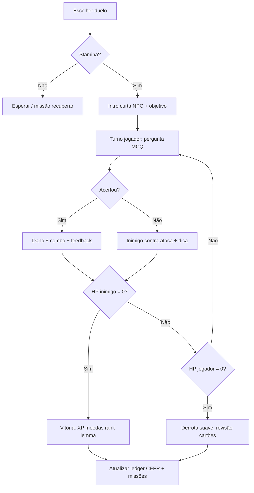
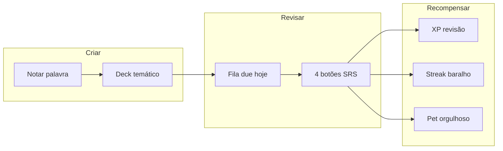
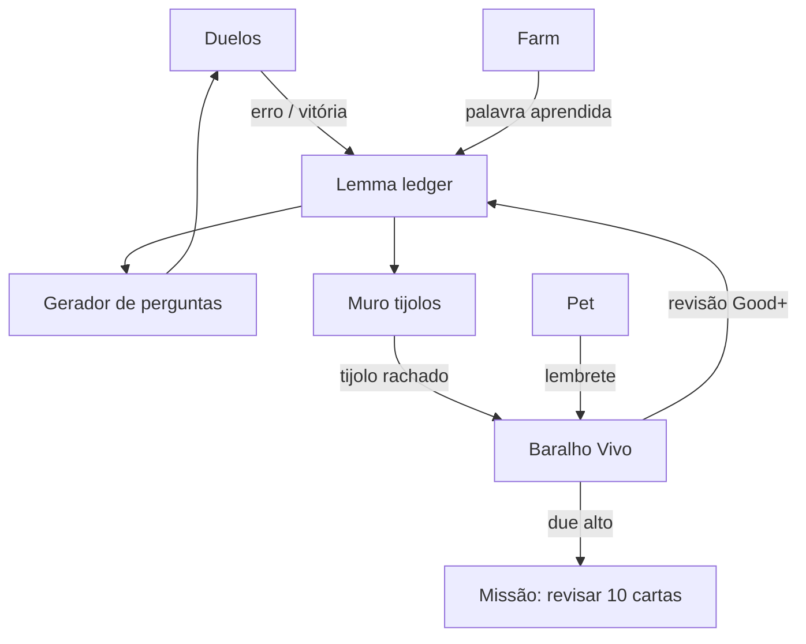
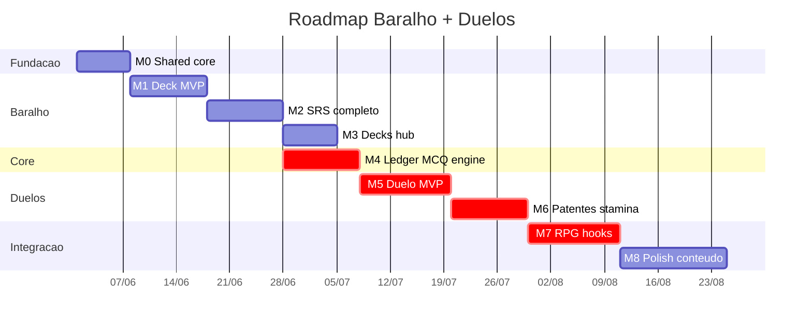
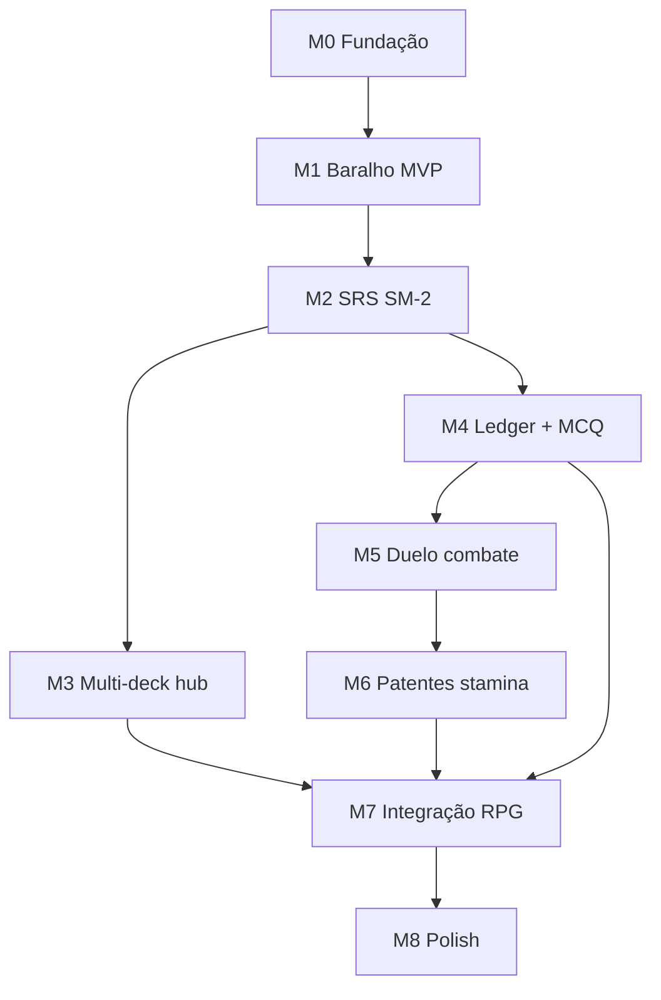

# English Quest — Duelos de Inglês & Baralho Vivo (Flashcards)

Documento de **game design + learning science** para dois sistemas irmãos:

1. **Duelos de Inglês** — batalhas por turnos onde cada ataque/defesa é uma pergunta de múltipla escolha; progressão de **básico → fluente** (CEFR).
2. **Baralho Vivo** — flashcards estilo Anki para anotar palavras, revisar com SRS e alimentar o resto do RPG.

> **Relacionados:** [PRD.md](./PRD.md), [GAMIFICATION_SYSTEMS.md](./GAMIFICATION_SYSTEMS.md), [INVISIBLE_LEARNING_SYSTEMS.md](./INVISIBLE_LEARNING_SYSTEMS.md), [MEMORY_WALL_LEXICON_BRICK.md](./MEMORY_WALL_LEXICON_BRICK.md), [LIVING_CITY.md](./LIVING_CITY.md)

---

## Índice

### Parte A — Duelos de Inglês

1. [Visão e fantasia](#a1-visão-e-fantasia)
2. [Loop principal](#a2-loop-principal)
3. [Progressão de inglês (básico → fluente)](#a3-progressão-de-inglês-básico--fluente)
4. [Combate por turnos](#a4-combate-por-turnos)
5. [Tipos de pergunta e dificuldade](#a5-tipos-de-pergunta-e-dificuldade)
6. [Inimigos, arenas e narrativa](#a6-inimigos-arenas-e-narrativa)
7. [Recompensas e economia](#a7-recompensas-e-economia)
8. [Integração com o app existente](#a8-integração-com-o-app-existente)
9. [Modelo de dados (Duelos)](#a9-modelo-de-dados-duelos)
10. [Fases de implementação (Duelos)](#a10-fases-de-implementação-duelos)

### Parte B — Baralho Vivo (Flashcards)

11. [Visão e fantasia](#b1-visão-e-fantasia)
12. [Loop Anki + gamificação](#b2-loop-anki--gamificação)
13. [SRS e estados do cartão](#b3-srs-e-estados-do-cartão)
14. [Criação e importação de cartões](#b14-criação-e-importação-de-cartões)
15. [Modos de revisão](#b15-modos-de-revisão)
16. [Integração Duelos ↔ Baralho ↔ Cidade](#b16-integração-duelos--baralho--cidade)
17. [Modelo de dados (Baralho)](#b17-modelo-de-dados-baralho)
18. [UX, copy e acessibilidade](#b18-ux-copy-e-acessibilidade)
19. [Fases de implementação (Baralho)](#b19-fases-de-implementação-baralho)

### Transversal

20. [Ledger único de competência](#c-ledger-único-de-competência)
21. [Balanceamento e anti-frustração](#c-balanceamento-e-anti-frustração)
22. [Métricas de sucesso](#c-métricas-de-sucesso)
23. [Priorização sugerida](#c-priorização-sugerida)

### Roadmap

24. [Visão geral do roadmap](#d1-visão-geral-do-roadmap)
25. [Marcos (M0–M8)](#d2-marcos-m0m8)
26. [Trilha Baralho Vivo (detalhe)](#d3-trilha-baralho-vivo-detalhe)
27. [Trilha Duelos (detalhe)](#d4-trilha-duelos-detalhe)
28. [Integração com o app](#d5-integração-com-o-app)
29. [Conteúdo e QA](#d6-conteúdo-e-qa)
30. [Checklist de release](#d7-checklist-de-release)

---

# Parte A — Duelos de Inglês

## A1. Visão e fantasia

**Nome do sistema (UI):** **Duelos de Inglês** (internamente: `english_duel`)

**Fantasia do jogador:**  
“Minha espada é o vocabulário. Cada resposta certa é um golpe; cada erro, uma brecha que o inimigo explora. Subo de rank na Liga da Cidade — de turista perdido a embaixador fluente.”

**Promessa de produto:**

| Para o jogador                                       | Para o pedagogo                           |
| ---------------------------------------------------- | ----------------------------------------- |
| Batalha rápida (2–4 min), offline                    | Avaliação formativa contínua (MCQ)        |
| Sensação de RPG, não de prova                        | Escada CEFR explícita mas invisível na UI |
| Erro não é game over — é aprendizado + contra-ataque | Dificuldade adaptativa por lemma/skill    |

**Princípio:** a batalha **nunca** é só quiz genérico. Cada duelo tem **contexto** (NPC, contrato, distrito, evento da cidade) e **stakes** leves (stamina, loot, rank).

---

## A2. Loop principal



**Sessão típica:** 5–12 perguntas por duelo (não 50). Foco em **qualidade + ritmo**, não maratona.

---

## A3. Progressão de inglês (básico → fluente)

### Trilha CEFR (ranks visíveis)

O jogador vê **Liga / Patente**, não “A2.1”. Por baixo, o app mapeia CEFR:

| Patente (UI) | CEFR interno | Foco de conteúdo                       | Desbloqueio típico |
| ------------ | ------------ | -------------------------------------- | ------------------ |
| Turista      | A1           | Palavras isoladas, frases curtas PT→EN | Início             |
| Morador      | A2           | Presente simples, rotina, lugares      | Nível jogador 3+   |
| Estagiário   | B1           | Tempos mistos, phrasal básicos         | Biblioteca POI     |
| Analista     | B2           | Conectores, formalidade, collocations  | Contratos tier 2   |
| Embaixador   | C1           | Nuance, idioms, registro               | Embassy POI        |
| Fluente      | C2           | Fine meaning, pragmática, humor        | Prestígio 1+       |

**Barra de domínio por skill** (ledger, não só rank):

- `vocabulary_recognition` — MCQ palavra ↔ significado
- `grammar_choice` — escolher forma correta
- `context_cloze` — lacuna em frase
- `pragmatics_register` — formal vs casual (alinhado ao doc de clima de registro)
- `listening_lite` (fase 2) — áudio curto + MCQ

Cada acerto/erro em duelo atualiza **pesos** nessas skills. O gerador de perguntas puxa do **weakest link** (70%) + revisão espaçada de lemmas fracos (30%).

### Subir de patente

Não é só grind de vitórias. Exige **prova de patente** (duelo especial, 15 perguntas, sem dica, 80% acerto):

- Ao passar: título cosmético, novo pool de inimigos, +% moedas em duelos da liga nova
- Ao falhar: feedback “o que treinar” → deck sugerido no Baralho Vivo + 1 duelo treino grátis

---

## A4. Combate por turnos

### Recursos de combate

| Recurso           | Significado                                    | Gamificação                                    |
| ----------------- | ---------------------------------------------- | ---------------------------------------------- |
| **HP do jogador** | 100 base; erro tira 15–25 conforme dificuldade | Escudo de streak protege 1 erro/dia (opcional) |
| **HP do inimigo** | Escala com patente do duelo                    | Boss = 150–200 HP                              |
| **Combo**         | 3 acertos seguidos → “Golpe crítico” (2× dano) | Haptic + SFX + partícula                       |
| **Foco**          | 1 carga/dia: elimina 1 alternativa errada      | Vem de pet feliz ou missão diária              |
| **Stamina**       | 5 duelos/dia base; +2 com season pass / item   | Recupera 1 a cada 4h offline                   |

### Turno do jogador (ataque)

1. Pergunta em inglês (enunciado pode ser PT ou EN conforme patente)
2. **4 alternativas** (1 correta; distractors do mesmo campo semântico)
3. Tempo opcional: sem timer no A1–A2; **15s** a partir de B1 (pressão leve)
4. Acerto → dano = `baseDamage × comboMultiplier × weaknessBonus`
5. Erro → inimigo usa **Contra-ataque pedagógico**: mostra regra em 1 linha + lemma vai para fila de revisão

### Turno do inimigo (só após erro)

Não é outra pergunta — é **narrativo + mecânico**:

- Animação curta (“O Guardião da Biblioteca aponta sua falha”)
- Perda de HP
- Opcional: **pergunta de defesa** (fase 2) — acertar reduz dano do contra-ataque em 50%

### Vitória / derrota suave

- **Vitória:** loot table por liga + chance de carta “trophy lemma”
- **Derrota:** HP a 0 mas jogador ganha **Consolation XP** (25%) + desbloqueia “Duelo de revisão” (3 perguntas só dos erros)
- Nunca perder rank por uma derrota — só **prova de patente** pode bloquear ascensão temporariamente

---

## A5. Tipos de pergunta e dificuldade

### Templates (MVP)

| `question_type`   | Exemplo                                    | Patente mínima |
| ----------------- | ------------------------------------------ | -------------- |
| `mcq_meaning`     | “What does _reluctant_ mean?”              | Turista        |
| `mcq_translation` | “Choose the English for: _eu acordo cedo_” | Turista        |
| `mcq_grammar`     | “She \_\_\_ to work every day.”            | Morador        |
| `mcq_cloze`       | “I look \_\_\_ to meeting you.”            | Estagiário     |
| `mcq_register`    | “Pick the formal greeting:”                | Analista       |
| `mcq_collocation` | “make a **_ / do a _**”                    | Embaixador     |
| `mcq_inference`   | Short paragraph + “What is implied?”       | Fluente        |

### Geração de distractors

- Mesmo POS e frequência similar (WordNet / lista curada por lemma)
- **Nunca** duas alternativas quase idênticas
- Log de distractor escolhido → ajustar se taxa de acerto > 95% (muito fácil)

### Banco de conteúdo

- **Pacotes JSON** por tema (`travel`, `work`, `food`) e CEFR
- Lemmas do `lemma-pool.json` e farm alimentam duelos dinâmicos
- Contratos podem exigir “Vença 2 duelos com tema `business`”

---

## A6. Inimigos, arenas e narrativa

### Arquétipos de inimigo

| Inimigo              | Tema                                  | Mecânica especial                            | Onde aparece    |
| -------------------- | ------------------------------------- | -------------------------------------------- | --------------- |
| Slime de Typos       | Spelling / homófonos                  | Distractors ortográficos                     | Tutorial        |
| Guardião do Presente | Verbos                                | Só `grammar_choice`                          | Biblioteca      |
| Sombra do Jet Lag    | Vocabulário de viagem                 | Contra-ataque forte se jogador errou à noite | Aeroporto POI   |
| Auditor de Contratos | Business English                      | Perguntas longas B2+                         | Contratos       |
| Echo do Pet          | Palavras que o pet “ouviu” você errar | Usa lemmas do ledger do companion            | Casa / pet      |
| Boss semanal         | Mix da liga                           | 20 HP por acerto, fase 2 em 50% HP           | Arena da cidade |

### Arenas (telas)

- **Coliseu da Praça** — duelos rápidos diários
- **Dojo da Biblioteca** — treino sem stamina (XP reduzido)
- **Embaixada** — ligas C1–C2
- **Evento sazonal** — inimigo temático (Halloween vocab)

Mapa: ícone de espada no POI quando há duelo disponível; badge “!” se boss semanal.

---

## A7. Recompensas e economia

| Ação                         | Recompensa base                       | Multiplicadores           |
| ---------------------------- | ------------------------------------- | ------------------------- |
| Duelo normal                 | XP, moedas, 0–1 lexicon brick         | Combo, patente, pet feliz |
| Boss semanal                 | Loot box raridade + título temporário | Streak 7+                 |
| Prova de patente             | Título permanente + emblema           | —                         |
| Duelo de revisão pós-derrota | Só XP lemma + reparo SRS              | —                         |

**Anti-inflação:** moedas de duelo **cap diário**; excesso vira “medalhas de duelo” (cosmético / season points).

**Season pass:** trilha “Liga do mês” — 30 níveis com skins de arena.

---

## A8. Integração com o app existente

| Sistema existente            | Como Duelos se conecta                                                                 |
| ---------------------------- | -------------------------------------------------------------------------------------- |
| **Missões diárias/semanais** | “Vença 1 duelo”, “Acerte 10 sem erro”, “Complete prova B1”                             |
| **Cidade / POIs**            | Arena desbloqueia com obra da biblioteca; NPCs dão duelos de cadeia                    |
| **Contratos**                | Objetivo `DUEL_WINS` ou `DUEL_THEME`                                                   |
| **Pet**                      | Pet “torce” (+5% dano) se alimentado; erro alimenta missão “treinar pet com palavra X” |
| **Lexicon / Muro**           | Lemmas vencidos em duelo geram tijolo com tag `source: duel`                           |
| **Focus Mode**               | Opcional: 5 min foco = +1 stamina (não stack infinito)                                 |
| **Prestígio**                | Mantém patente CEFR; reseta apenas rank competitivo sazonal                            |
| **GameEvents**               | `DUEL_WON`, `DUEL_LOST`, `PATENT_PROMOTED`, `LEMMA_WEAK`                               |
| **Áudio**                    | SFX hit/miss; TTS opcional do enunciado (fase 2)                                       |

---

## A9. Modelo de dados (Duelos)

```sql
-- Patente / liga do jogador
duel_player_profile (
  id INTEGER PRIMARY KEY,
  current_patent TEXT NOT NULL,        -- tourist | resident | ...
  patent_xp INTEGER NOT NULL DEFAULT 0,
  highest_patent TEXT NOT NULL,
  stamina INTEGER NOT NULL,
  stamina_updated_at TEXT NOT NULL,
  focus_charges INTEGER NOT NULL DEFAULT 1,
  daily_duel_count INTEGER NOT NULL DEFAULT 0,
  daily_reset_date TEXT NOT NULL
);

-- Sessão de duelo
duel_sessions (
  id TEXT PRIMARY KEY,
  enemy_key TEXT NOT NULL,
  arena_key TEXT NOT NULL,
  patent_at_start TEXT NOT NULL,
  player_hp INTEGER NOT NULL,
  enemy_hp INTEGER NOT NULL,
  combo_streak INTEGER NOT NULL DEFAULT 0,
  status TEXT NOT NULL,                -- active | won | lost | abandoned
  started_at TEXT NOT NULL,
  ended_at TEXT
);

-- Perguntas da sessão (ordem fixa para replay/debug)
duel_session_questions (
  id TEXT PRIMARY KEY,
  session_id TEXT NOT NULL,
  sort_order INTEGER NOT NULL,
  question_type TEXT NOT NULL,
  lemma TEXT,
  prompt_json TEXT NOT NULL,           -- { stem, choices[], correctIndex, hint }
  answered_index INTEGER,
  is_correct INTEGER,
  response_ms INTEGER,
  damage_dealt INTEGER
);

-- Ledger agregado (espelha invisible learning)
lemma_duel_stats (
  lemma TEXT PRIMARY KEY,
  times_seen INTEGER NOT NULL,
  times_correct INTEGER NOT NULL,
  last_seen_at TEXT,
  weakness_score REAL NOT NULL           -- 0..1 para gerador
);
```

**Zustand:** estado de combate em memória; persistência só em SQLite ao fim do turno ou da sessão.

---

## A10. Fases de implementação (Duelos)

| Fase  | Escopo                                                        | Critério de pronto            |
| ----- | ------------------------------------------------------------- | ----------------------------- |
| **0** | Coliseu + 1 inimigo + `mcq_meaning` / `mcq_translation` A1–A2 | 1 duelo ponta a ponta offline |
| **1** | Stamina, combo, contra-ataque, derrota suave                  | Loop diário estável           |
| **2** | Patentes, prova de patente, pools B1–B2                       | Subir de Morador → Estagiário |
| **3** | Boss semanal, missões, GameEvents                             | Integrado à home/cidade       |
| **4** | Inimigos POI, contratos, pet echo                             | Narrativa distribuída         |
| **5** | Timer, `listening_lite`, PvP async (opcional)                 | Liga competitiva sazonal      |

---

# Parte B — Baralho Vivo (Flashcards)

## B1. Visão e fantasia

**Nome (UI):** **Baralho Vivo** (internamente: `flash_deck`)

**Fantasia:**  
“Cada palavra que quero lembrar vira uma carta na minha mochila. O pet me lembra de revisar antes que a tinta desbote. Não é planilha — é arsenal para os duelos e tijolos para a cidade.”

**Diferença vs Muro da Memória:**

| Muro da Memória                        | Baralho Vivo                                       |
| -------------------------------------- | -------------------------------------------------- |
| Palavras do **farm/app** viram tijolos | Palavras **escolhidas pelo jogador** (e sugeridas) |
| Construção urbana                      | Revisão pessoal estilo Anki                        |
| Decay afeta **obras**                  | Decay afeta **cartão** (again/hard/good/easy)      |

Os dois **convergem** no ledger de lemmas (ver §C).

---

## B2. Loop Anki + gamificação



### Metáforas gamificadas (não quebrar SRS)

| Conceito Anki | Skin no app                                                  |
| ------------- | ------------------------------------------------------------ |
| Deck          | **Caderno** (capa customizável)                              |
| Card          | **Carta** com “tinta viva” → “tinta desbotando” → “pálida”   |
| Due           | **Cartas na mesa do pet** (notificação amigável)             |
| Again         | **Reforjar** (martelinho animado)                            |
| Study streak  | **Sequência de tinta** (7 dias = moldura do caderno)         |
| Leech         | **Carta pregueira** — app sugere mnemônico ou dividir cartão |

**Regra de ouro:** botões Again/Hard/Good/Easy mantêm semântica SRS real; só a **apresentação** é gamificada.

---

## B3. SRS e estados do cartão

### Algoritmo (MVP: SM-2 simplificado)

Campos por cartão:

- `ease_factor` (default 2.5)
- `interval_days`
- `repetitions`
- `due_at`
- `lapse_count`

Botões:

| Botão     | Efeito                   | UX copy    |
| --------- | ------------------------ | ---------- |
| **Again** | Reset intervalo ~10 min  | “Reforjar” |
| **Hard**  | Intervalo × 1.2          | “Quase”    |
| **Good**  | Intervalo normal SM-2    | “Lembrei”  |
| **Easy**  | Intervalo × 1.3 + ease ↑ | “Fácil!”   |

### Estados visuais

| Estado       | Condição          | Visual                     |
| ------------ | ----------------- | -------------------------- |
| `new`        | Nunca revisado    | Carta brilhante            |
| `learning`   | Intervalo < 1 dia | Borda azul                 |
| `review`     | Due               | Pulsa no hub               |
| `relearning` | Lapse             | Rachadura na carta         |
| `mature`     | interval ≥ 21d    | Selo dourado               |
| `leech`      | lapses ≥ 8        | Ícone pregueira + sugestão |

### Limites saudáveis

- **Novo/dia:** 10 cartas (ajustável)
- **Revisão/dia:** cap suave 80; excesso vira “arquivo” sem punir streak
- **Snooze:** adiar deck 1 dia (viagem) — 3 usos/mês

---

## B14. Criação e importação de cartões

### Criar cartão (fluxo rápido)

1. **Frente:** palavra/frase em inglês (obrigatório)
2. **Verso:** tradução ou definição PT (obrigatório)
3. Opcional: exemplo, áudio gravado, tag, imagem (galeria)
4. Escolher **Caderno** (deck) — default “Minhas palavras”
5. Auto: `lemma` normalizado, `cefr_guess` por frequência

**Atalhos de entrada:**

- Botão **+** no duelo (“Salvar palavra que errei”)
- Long press no farm
- Compartilhar texto → “Criar carta a partir disso” (fase 2)

### Importação

- CSV: `front,back,tags`
- Export Anki `.apkg` (fase 3 — complexo)
- Pacotes oficiais por tema (“Entrevista de emprego”, “Viagem”) — moedas ou season

### Cartões sugeridos pelo app

- Erros em duelos → cartão **sugerida** (jogador confirma 1 toque)
- Lemmas do muro rachado → “Reparar no baralho”
- Não duplicar: merge por `lemma` + mesmo sentido

---

## B15. Modos de revisão

| Modo                  | Descrição                                    | Stamina / recompensa                     |
| --------------------- | -------------------------------------------- | ---------------------------------------- |
| **Revisão clássica**  | Frente → virar → 4 botões                    | XP revisão padrão                        |
| **Só reconhecimento** | MCQ com 4 traduções                          | Metade XP, bom para mobilidade           |
| **Só produção**       | Digitar palavra (fase 2)                     | 1.5× XP, alimenta skill `production`     |
| **Blitz 2 min**       | Máx cartas em tempo                          | Season points, sem alterar SRS agressivo |
| **Duelo de cartas**   | 5 cartas due viram perguntas de duelo treino | Ponte para Parte A                       |
| **Sonho noturno**     | Revisão passiva: swipe “sei / não sei”       | 30s, não substitui SRS principal         |

---

## B16. Integração Duelos ↔ Baralho ↔ Cidade



**Sinergias concretas:**

1. **Errou no duelo** → cartão sugerido + lemma `weakness_score` ↑
2. **Revisou carta Good+** → +5% dano em duelos com esse lemma (24h)
3. **Caderno “Viagem” completo** (90% mature) → desconto stamina no aeroporto
4. **Boss semanal** → pool prioriza lemmas com `due` hoje no baralho
5. **Conquistas:** “100 cartas mature”, “30 dias sequência tinta”

---

## B17. Modelo de dados (Baralho)

```sql
flash_decks (
  id TEXT PRIMARY KEY,
  name TEXT NOT NULL,
  description TEXT,
  cover_emoji TEXT,
  sort_order INTEGER NOT NULL DEFAULT 0,
  new_per_day INTEGER NOT NULL DEFAULT 10,
  review_cap INTEGER NOT NULL DEFAULT 80,
  created_at TEXT NOT NULL,
  archived_at TEXT
);

flash_cards (
  id TEXT PRIMARY KEY,
  deck_id TEXT NOT NULL,
  lemma TEXT,
  front TEXT NOT NULL,
  back TEXT NOT NULL,
  example_sentence TEXT,
  audio_uri TEXT,
  image_uri TEXT,
  tags_json TEXT NOT NULL DEFAULT '[]',
  source TEXT NOT NULL,              -- user | duel_suggest | farm | import | pack
  ease_factor REAL NOT NULL DEFAULT 2.5,
  interval_days INTEGER NOT NULL DEFAULT 0,
  repetitions INTEGER NOT NULL DEFAULT 0,
  lapse_count INTEGER NOT NULL DEFAULT 0,
  due_at TEXT NOT NULL,
  state TEXT NOT NULL,               -- new | learning | review | relearning | mature
  last_reviewed_at TEXT,
  created_at TEXT NOT NULL,
  suspended INTEGER NOT NULL DEFAULT 0
);

flash_review_log (
  id TEXT PRIMARY KEY,
  card_id TEXT NOT NULL,
  rating TEXT NOT NULL,              -- again | hard | good | easy
  previous_interval INTEGER,
  new_interval INTEGER,
  reviewed_at TEXT NOT NULL,
  session_id TEXT,
  duration_ms INTEGER
);

flash_study_sessions (
  id TEXT PRIMARY KEY,
  deck_id TEXT,
  mode TEXT NOT NULL,
  cards_reviewed INTEGER NOT NULL,
  started_at TEXT NOT NULL,
  ended_at TEXT
);
```

**Índices:** `(due_at, suspended)`, `(deck_id, state)`.

---

## B18. UX, copy e acessibilidade

### Hub do Baralho

- Card grande: **“12 cartas na mesa hoje”**
- Sub: “O Buddy guardou elas para você”
- CTA primário: **Começar revisão**
- Secundário: **Nova carta** | **Meus cadernos**

### Tela de revisão

- Gestos: swipe esquerda = Again, direita = Good (opcional, desligável)
- Sempre mostrar 4 botões para precisão pedagógica
- **Loading** em salvar revisão (mesmo padrão do resgate de recompensas)
- Modo daltônico nas bordas dos botões SRS

### Copy (tom English Quest)

- Again: “Reforjar — volta já já”
- Leech: “Essa carta está pregueira. Quer um truque de memória?”
- Streak: “Tinta fresca há {n} dias”

---

## B19. Fases de implementação (Baralho)

| Fase  | Escopo                                                      |
| ----- | ----------------------------------------------------------- |
| **0** | CRUD cartão + 1 deck + revisão Good/Again + due             |
| **1** | 4 botões SM-2, log, estatísticas simples                    |
| **2** | Múltiplos cadernos, tags, sugestão pós-duelo                |
| **3** | Modos MCQ + Blitz, notificações, pet lembrete               |
| **4** | Import CSV, pacotes temáticos, leech helper                 |
| **5** | Produção digitada, sync opcional (se um dia houver backend) |

---

# Transversal

## C. Ledger único de competência

Um único serviço `LemmaCompetenceService` alimentado por:

| Fonte   | Atualiza                           |
| ------- | ---------------------------------- |
| Duelo   | `recognition`, `grammar`, weakness |
| Baralho | `retention`, intervalo implícito   |
| Farm    | `first_exposure`                   |
| Muro    | `transfer` (uso em obra)           |

Duelos **leem** weakness para montar perguntas; Baralho **escreve** retenção; cidade **exige** transfer.

Evita três SRS competindo: **um ledger**, várias “skins” de revisão.

---

## C. Balanceamento e anti-frustração

| Risco                         | Mitigação                                                          |
| ----------------------------- | ------------------------------------------------------------------ |
| Duelo vira prova estressante  | Derrota suave, sem perda de patente; dojo sem stamina              |
| Farm + Baralho + Duelo demais | Stamina duelo + cap revisão + missões não exigem os 3 no mesmo dia |
| Cartões demais                | Leech, merge, snooze                                               |
| Conteúdo repetido             | Gerador 70% weak / 30% spaced; pools por tema                      |
| Pay-to-win                    | Season pass = cosmético + stamina +1, não patente                  |

---

## C. Métricas de sucesso

| Métrica     | Duelos                                 | Baralho                              |
| ----------- | -------------------------------------- | ------------------------------------ |
| Retenção D7 | % que fez ≥3 duelos                    | % com ≥1 sessão revisão              |
| Aprendizado | Acerto por patente ↑ ao longo do tempo | % cartas mature                      |
| Engajamento | Duelos/dia, taxa vitória               | Cartas revisadas/sessão              |
| Integração  | % erros que viraram cartão             | % due que apareceram em duelo treino |

---

## C. Priorização sugerida

Ordem de execução (detalhada em [§D. Roadmap](#d1-visão-geral-do-roadmap)):

1. **M0** — Fundação compartilhada (tipos, migrations, feature flags)
2. **M1–M3** — Baralho Vivo até revisão SRS completa + hub
3. **M4** — Ledger de lemmas + motor MCQ compartilhado
4. **M5–M6** — Duelos jogável + patentes A1–B1
5. **M7** — Integração cidade, missões, pet, farm
6. **M8** — Boss, prova de patente, conteúdo B2+, polish

---

# Parte D — Roadmap de implementação

> **Como usar este roadmap:** cada marco **M*n*** tem Definition of Done (DoD), artefatos em `src/`, migration Drizzle e dependências explícitas. Estimativas são **relativas** (S/M/L por marco), não datas fixas — ajuste conforme velocidade do time.

---

## D1. Visão geral do roadmap

### Linha do tempo (marcos)

**Início sugerido:** 1 jun 2026 · **Duração total:** ~12 semanas (82 dias úteis de calendário) · **M4** corre em **paralelo** com M3 (ambos após M2).



| Marco | Início | Fim (est.) | Dias | Paralelo com |
| ----- | ------ | ---------- | ---- | ------------ |
| M0    | 01/06  | 07/06      | 7    | —            |
| M1    | 08/06  | 17/06      | 10   | —            |
| M2    | 18/06  | 27/06      | 10   | —            |
| M3    | 28/06  | 04/07      | 7    | **M4**       |
| M4    | 28/06  | 07/07      | 10   | **M3**       |
| M5    | 08/07  | 19/07      | 12   | —            |
| M6    | 20/07  | 29/07      | 10   | —            |
| M7    | 30/07  | 10/08      | 12   | —            |
| M8    | 11/08  | 24/08      | 14   | —            |

> **Caminho crítico:** M0 → M1 → M2 → M4 → M5 → M6 → M7 → M8 (marcado `crit` no Gantt). M3 pode atrasar sem bloquear duelos; M7 só exige M3 concluído para integração completa do Baralho.

### Mapa de dependências



### Resumo por marco

| Marco  | Nome               | Esforço | Baralho  | Duelos   | Entrega principal                                          |
| ------ | ------------------ | ------- | -------- | -------- | ---------------------------------------------------------- |
| **M0** | Fundação           | S       | —        | —        | Tipos, migrations vazias, flags, pasta `features/learning` |
| **M1** | Baralho MVP        | M       | Fase 0   | —        | CRUD cartão, 1 deck, revisão Again/Good                    |
| **M2** | SRS completo       | M       | Fase 1   | —        | 4 botões, log, estatísticas                                |
| **M3** | Hub Baralho        | S       | Fase 2   | —        | Multi-deck, tags, entrada no app                           |
| **M4** | Core compartilhado | M       | —        | prep     | `LemmaCompetenceService`, MCQ engine, pools JSON           |
| **M5** | Duelo MVP          | L       | —        | Fase 0–1 | Combate 1 inimigo, vitória/derrota                         |
| **M6** | Duelo progressão   | M       | —        | Fase 2   | Patentes, stamina, combo, dojo                             |
| **M7** | Integração RPG     | L       | Fase 3   | Fase 3–4 | Missões, cidade, pet, sugestão cartão                      |
| **M8** | Polish & escala    | L       | Fase 4–5 | Fase 4–5 | Boss, prova patente, CSV, B2+ content                      |

**Legenda de esforço:** S ≈ 3–5 dias úteis · M ≈ 1–2 semanas · L ≈ 2–3 semanas (1 dev focado).

---

## D2. Marcos (M0–M8)

### M0 — Fundação compartilhada

**Objetivo:** preparar o terreno sem UI visível ao usuário final.

| Item               | Detalhe                                                                                          |
| ------------------ | ------------------------------------------------------------------------------------------------ |
| **Migration**      | `drizzle/0033_learning_systems.sql` — tabelas §A9 + §B17 (pode criar vazias / com seeds mínimos) |
| **Schema Drizzle** | `src/storage/database/schema.ts` — `flash_*`, `duel_*`, `lemma_competence`                       |
| **Tipos**          | `src/types/flash-card.ts`, `duel.ts`, `mcq-question.ts`, `lemma-competence.ts`                   |
| **Feature flags**  | `src/constants/feature-flags.ts` — `FLASH_DECK_ENABLED`, `DUELS_ENABLED` (default `false`)       |
| **Pastas**         | `src/features/flash-deck/`, `src/features/duels/`, `src/features/learning/` (shared)             |
| **Loader**         | `src/data/loaders/duel-questions.ts` — stub lendo JSON futuro                                    |

**DoD**

- [x] `pnpm exec tsc --noEmit` sem erros
- [x] Migration `0033_learning_systems.sql` + `reconcileLearningSystemsSchema`
- [x] Flags `FLASH_DECK_ENABLED` / `DUELS_ENABLED` default `false` (sem rotas `app/` até M1/M5)

**Status:** ✅ Implementado (M0).

**Dependências:** nenhuma (só stack atual: SQLite, Drizzle, Expo Router).

---

### M1 — Baralho MVP (Fase 0)

**Objetivo:** jogador cria cartão, revisa com Again/Good, vê fila _due_.

| Camada          | Entregáveis                                                                                |
| --------------- | ------------------------------------------------------------------------------------------ |
| **Repository**  | `flash-deck-repository.ts` — decks, cards, insert/update due                               |
| **Service**     | `flash-deck-service.ts`, `flash-srs-service.ts` (Again/Good simplificado: 10 min / +1 dia) |
| **Store**       | `flash-deck-store.ts` (Zustand UI)                                                         |
| **UI**          | `app/flash-deck/index.tsx`, `CardEditorScreen`, `ReviewScreen` (flip + 2 botões)           |
| **Componentes** | `FlashCardFace`, `SrsButtonRow` (2 botões no MVP)                                          |
| **Seed**        | Deck default `"Minhas palavras"` na primeira abertura                                      |

**DoD**

- [x] Criar cartão frente/verso offline persiste após restart
- [x] Revisão atualiza `due_at` e `state`
- [x] Hub mostra contagem “N cartas para hoje”
- [x] Loading ao salvar revisão (`useAsyncAction`)

**Status:** ✅ Implementado (M1).

**Dependências:** M0.

**Alinha com:** [B19 Fase 0](#b19-fases-de-implementação-baralho).

---

### M2 — Baralho SRS completo (Fase 1)

**Objetivo:** paridade pedagógica com Anki (4 botões SM-2).

| Item        | Detalhe                                                                                          |
| ----------- | ------------------------------------------------------------------------------------------------ |
| **SRS**     | `flash-srs-service.ts` — ease, interval, lapses; estados `new/learning/review/relearning/mature` |
| **Log**     | `flash_review_log` persistido                                                                    |
| **UI**      | 4 botões com copy gamificado ([§B18](#b18-ux-copy-e-acessibilidade))                             |
| **Stats**   | `FlashDeckStatsCard` — novos, due, mature, streak revisão                                        |
| **Limites** | `new_per_day`, `review_cap` por deck                                                             |

**DoD**

- [x] Intervalos batem com casos de teste SM-2 (`flash-srs.test.ts`)
- [x] Leech flag após 8 lapses (badge + banner na revisão)
- [x] Sessão grava `flash_study_sessions`
- [x] 4 botões SRS + `FlashDeckStatsCard` + limites `new_per_day` / `review_cap`

**Status:** ✅ Implementado (M2).

**Dependências:** M1.

---

### M3 — Hub Baralho multi-deck (Fase 2 parcial)

**Objetivo:** vários cadernos, tags, navegação integrada.

| Item             | Detalhe                                                        |
| ---------------- | -------------------------------------------------------------- |
| **CRUD deck**    | criar, renomear, arquivar, emoji capa                          |
| **Tags**         | `tags_json` filtrável na lista de cartões                      |
| **Rotas**        | `app/flash-deck/deck/[id].tsx`, `app/flash-deck/card/[id].tsx` |
| **Tab / menu**   | entrada em Profile ou Quests hub (“Baralho Vivo”) com flag     |
| **Empty states** | copy do pet quando 0 due                                       |

**DoD**

- [x] ≥2 decks isolados; cartão não vaza entre decks
- [x] Busca por lemma/tag funciona offline

**Status:** ✅ Implementado (M3).

**Dependências:** M2.

---

### M4 — Ledger + motor MCQ (core compartilhado)

**Objetivo:** uma fonte de verdade para lemmas fracos e perguntas reutilizáveis (Baralho + Duelos).

| Item                | Detalhe                                                                                                   |
| ------------------- | --------------------------------------------------------------------------------------------------------- |
| **Service**         | `src/features/learning/services/lemma-competence-service.ts`                                              |
| **Tabela**          | `lemma_competence` (+ opcional `lemma_duel_stats` se não unificar)                                        |
| **MCQ engine**      | `src/features/learning/services/mcq-question-service.ts` — montar pergunta, distractors, validar resposta |
| **Conteúdo**        | `src/data/duel-questions/a1-travel.json`, loader + validação Zod                                          |
| **Integração leve** | Farm `WORDS_LEARNED` → `recordExposure(lemma)`                                                            |
| **Testes**          | unitários distractor + weak lemma picker (70/30)                                                          |

**DoD**

- [x] `getWeakLemmas(n)` retorna ordenado por `weakness_score`
- [x] `buildMcq({ type, lemma, patent })` retorna 4 opções, 1 correta
- [x] Farm e flash review (Good+) atualizam ledger

**Status:** ✅ Implementado (M4).

**Dependências:** M2 (precisa de lemmas em cartões).

**Bloqueia:** M5 (Duelos).

---

### M5 — Duelo MVP (Fases 0–1)

**Objetivo:** uma batalha completa contra Slime de Typos, A1–A2.

| Item            | Detalhe                                                               |
| --------------- | --------------------------------------------------------------------- |
| **Repository**  | `duel-repository.ts` — profile, sessions, session_questions           |
| **Services**    | `duel-service.ts`, `duel-combat-service.ts`, `duel-reward-service.ts` |
| **Store**       | `duel-store.ts` — HP, combo, turno atual                              |
| **UI**          | `app/duels/index.tsx` (arena), `app/duels/battle.tsx`                 |
| **Componentes** | `DuelEnemyBar`, `DuelPlayerBar`, `McqQuestionCard`, `CombatFeedback`  |
| **Inimigo**     | `slime_typos` em `src/data/duels/enemies.json`                        |
| **Perguntas**   | `mcq_meaning`, `mcq_translation` só Turista/Morador                   |
| **Áudio**       | hit/miss via `audio-director` (opcional M5, recomendado)              |

**DoD**

- [x] 5–12 perguntas por sessão; vitória quando HP inimigo = 0
- [x] Erro reduz HP jogador + hint 1 linha
- [x] Recompensa XP/moedas via `player-store.addMissionRewards` ou evento dedicado
- [x] Sessão persistida em `duel_sessions` ao terminar

**Status:** ✅ Implementado (M5).

**Dependências:** M4.

**Alinha com:** [A10 Fase 0–1](#a10-fases-de-implementação-duelos).

---

### M6 — Duelo progressão (Fase 2)

**Objetivo:** stamina, combo crítico, derrota suave, patentes, dojo.

| Item              | Detalhe                                                             |
| ----------------- | ------------------------------------------------------------------- |
| **Profile**       | `duel_player_profile` — stamina 5/dia, reset 4h, `focus_charges`    |
| **Patentes**      | enum + UI `DuelPatentBadge`; progressão Turista→Morador→Estagiário  |
| **Prova**         | `app/duels/patent-exam.tsx` — 15 perguntas, 80% (só Morador no MVP) |
| **Dojo**          | duelo sem stamina, XP ×0.5                                          |
| **Derrota suave** | Consolation XP + `app/duels/rematch-review.tsx` (só erros)          |
| **Combo**         | 3 acertos → crítico ×2 + haptic                                     |

**DoD**

- [x] Stamina não negativa; cap diário respeitado após restart
- [x] Subir de Turista→Morador via prova bloqueia pool A1 em duelos ranked
- [x] Derrota nunca zera patente

**Status:** ✅ Implementado (M6).

**Dependências:** M5.

---

### M7 — Integração RPG (ambos sistemas)

**Objetivo:** Baralho e Duelos deixam de ser ilhas; alimentam o loop do English Quest.

| Sistema             | Integração                                                             |
| ------------------- | ---------------------------------------------------------------------- |
| **Duelo → Baralho** | Modal “Salvar palavra?” após erro; `source: duel_suggest`              |
| **Baralho → Duelo** | Modo “Duelo de cartas” (5 due → treino sem stamina)                    |
| **Missões**         | Templates `DUEL_WIN`, `FLASH_REVIEW_N`, `DUEL_NO_MISS` em weekly/daily |
| **Cidade**          | POI `city_arena` ou biblioteca — ícone espada, 1 duelo/dia bônus       |
| **Pet**             | Notificação copy + vital se revisão due ignorada 48h                   |
| **GameEvents**      | `DUEL_WON`, `DUEL_LOST`, `FLASH_SESSION_DONE`, `PATENT_PROMOTED`       |
| **Lexicon**         | Vitória duelo com lemma novo → `CityResourceService` ou futuro tijolo  |
| **Home hub**        | Card “3 duelos · 12 cartas na mesa” (feature flag)                     |

**Arquivos tocados (referência)**

- `src/services/game-events.ts` — novos eventos
- `src/features/quests/constants/` — templates
- `src/features/city/constants/city-ui.ts` — copy arena
- `src/features/home/components/` — widget opcional

**DoD**

- [x] Completar duelo incrementa missão diária relevante
- [x] Erro em duelo oferece cartão em 1 toque
- [x] `GameEvents` disparam achievements existentes onde couber

**Dependências:** M3, M6, M4.

**Alinha com:** [B16](#b16-integração-duelos--baralho--cidade), [A8](#a8-integração-com-o-app-existente).

**Status:** ✅ Implementado (M7).

---

### M8 — Polish, conteúdo e escala

**Objetivo:** experiência “shippable” para usuários além do MVP interno.

| Trilha       | Itens                                                                        |
| ------------ | ---------------------------------------------------------------------------- |
| **Duelos**   | Boss semanal, B1–B2 pools, timer 15s, inimigos POI, prova Estagiário+        |
| **Baralho**  | Import CSV, modo MCQ revisão, Blitz 2 min, leech helper, notificações locais |
| **Conteúdo** | ≥200 perguntas JSON por patente A1–B1; pacote “Viagem”                       |
| **Balance**  | caps moedas duelo, tabela stamina/HP em `docs/BALANCE_AUDIT.md`              |
| **QA**       | checklist manual offline, performance revisão 80 cartas < 2s/frame           |

**DoD**

- [x] `FEATURES.md` atualizado com Baralho + Duelos
- [x] Flags `FLASH_DECK_ENABLED` / `DUELS_ENABLED` = `true` em build de release
- [x] Métricas §C instrumentadas (log local / debug screen)

**Dependências:** M7.

**Status:** ✅ Implementado (M8).

---

## D3. Trilha Baralho Vivo (detalhe)

Checklist sequencial (pode virar issues no GitHub):

| #   | Tarefa                                                                             | Marco |
| --- | ---------------------------------------------------------------------------------- | ----- |
| 1   | Migration `flash_decks`, `flash_cards`, `flash_review_log`, `flash_study_sessions` | M0    |
| 2   | Repositório + service CRUD                                                         | M1    |
| 3   | Tela criar/editar cartão + validação Zod                                           | M1    |
| 4   | Tela revisão 2 botões + persist due                                                | M1    |
| 5   | Hub contagem due + CTA                                                             | M1    |
| 6   | SM-2 completo + 4 botões UI                                                        | M2    |
| 7   | Estados visuais cartão (new/mature/leech)                                          | M2    |
| 8   | Estatísticas por deck                                                              | M2    |
| 9   | Multi-deck + tags + rotas                                                          | M3    |
| 10  | Entrada no app (tab/profile) + feature flag                                        | M3    |
| 11  | Sugestão pós-duelo (card pré-preenchido)                                           | M7    |
| 12  | Modo MCQ + Blitz                                                                   | M8    |
| 13  | Import CSV + DocumentPicker                                                        | M8    |
| 14  | Notificações `expo-notifications` due                                              | M8    |

---

## D4. Trilha Duelos (detalhe)

| #   | Tarefa                             | Marco |
| --- | ---------------------------------- | ----- |
| 1   | Migration duel + lemma stats       | M0    |
| 2   | `mcq-question-service` + JSON A1   | M4    |
| 3   | `lemma-competence-service`         | M4    |
| 4   | Repositório duel sessions          | M5    |
| 5   | UI combate + HP bars + MCQ card    | M5    |
| 6   | Loop vitória/derrota + recompensas | M5    |
| 7   | Stamina + profile + daily reset    | M6    |
| 8   | Combo + crítico + feedback         | M6    |
| 9   | Patentes + prova + dojo            | M6    |
| 10  | Derrota suave + rematch review     | M6    |
| 11  | Arena na cidade + missões          | M7    |
| 12  | Boss semanal + loot table          | M8    |
| 13  | Pools B1–B2 + timer                | M8    |
| 14  | Inimigo Echo do Pet (ledger)       | M8    |

---

## D5. Integração com o app

Ordem sugerida **dentro de M7** (evita merge conflicts):

1. `GameEvents` + tipos
2. Templates de missão (daily antes de weekly)
3. Widget home (opcional, flag)
4. POI cidade / deep link `app/duels?arena=plaza`
5. Farm → ledger
6. Achievement keys novas (`duel_first_win`, `flash_7_day_streak`)
7. Season pass trilha cosmética (se season ativa)

**Não fazer antes de M4:** gerar perguntas de duelo a partir de cartões due (precisa ledger).

**Não fazer antes de M6:** missões “vença sem erro” (stamina estável).

---

## D6. Conteúdo e QA

### Pacotes de conteúdo (JSON)

| Arquivo            | Patente    | Qtd mín. | Marco |
| ------------------ | ---------- | -------- | ----- |
| `a1-core.json`     | Turista    | 80       | M5    |
| `a2-routine.json`  | Morador    | 80       | M6    |
| `b1-work.json`     | Estagiário | 120      | M8    |
| `b2-abstract.json` | Analista   | 120      | M8    |

Schema Zod: `McqQuestionSchema` em `src/features/learning/schemas/`.

### QA manual (por release)

| Cenário            | Passos                                                               |
| ------------------ | -------------------------------------------------------------------- |
| Offline cold start | Avião mode → revisar 5 cartas → duelo → restart app → dados intactos |
| Stamina            | 5 duelos → 6º bloqueado → esperar reset / debug advance clock        |
| SRS                | Again → due 10 min; Good → due amanhã                                |
| Integração         | Erro duelo → salvar cartão → aparece na revisão                      |
| Performance        | 80 cartas due, scroll lista < 100ms jank perceptível                 |

### Testes automatizados (prioridade)

| Área                   | Tipo                                                           |
| ---------------------- | -------------------------------------------------------------- |
| `flash-srs-service`    | Unit — intervalos SM-2                                         |
| `mcq-question-service` | Unit — 4 opções únicas, índice correto                         |
| `duel-combat-service`  | Unit — dano combo, HP floor 0                                  |
| Repositories           | Integration com SQLite in-memory (se já houver padrão no repo) |

---

## D7. Checklist de release

Antes de ligar flags para todos os usuários:

- [ ] Migrations testadas em DB com dados reais de beta (backup export JSON)
- [ ] Copy PT revisado ([§B18](#b18-ux-copy-e-acessibilidade))
- [ ] Sem PII em `flash_review_log` exportável
- [ ] `AGENTS.md` / `FEATURES.md` mencionam rotas novas
- [ ] Tutorial primeira abertura: 1 cartão demo + 1 duelo tutorial (sem stamina)
- [ ] Balance pass: XP duelo não supera farm em XP/hora (ver [BALANCE_AUDIT.md](./BALANCE_AUDIT.md))
- [ ] Acessibilidade: MCQ com `accessibilityLabel` por alternativa
- [ ] Crash-free em Android + iOS (build EAS) nas flows M1 + M5

---

## Apêndice — Exemplo de sessão (narrativa)

> *Você entra no Coliseu da Praça. O Slime de Typos pisca “their / there / they’re”. Stamina: 3/5. Combo x2 — Golpe crítico! O slime derrete. +40 XP, +12 moedas. O app sugere: “Salvar *their* no caderno Viagem?” — um toque. À noite, o pet traz 4 cartas na mesa. Você revisa em 3 minutos. Amanhã, o duelo de treino usa exatamente essas palavras. A biblioteca na cidade ganha +1 tijolo.*

---

_Documento vivo — versão 1.2. M0 fundação implementado. Atualizar status dos marcos (M1–M8) conforme implementação._
