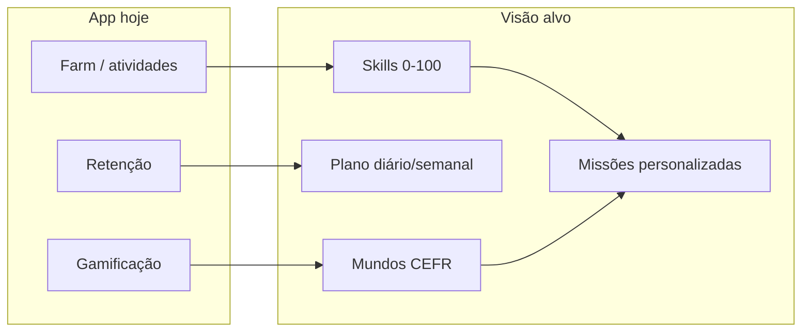

# English Quest — Roadmap Completo de Aprendizado de Inglês

Especificação do **GPS de aprendizado**: sistema guiado que mostra exatamente o que estudar, quando estudar e qual é o próximo passo — do inglês iniciante (A1) até domínio avançado (C2).

> **Relacionados:** [`PRD.md`](./PRD.md), [`FEATURES.md`](./FEATURES.md), [`IMPLEMENTATION_PLAN.md`](./IMPLEMENTATION_PLAN.md) (Fase 22+), [`MENTOR_AI_OFFLINE.md`](./MENTOR_AI_OFFLINE.md) (Fase 28+), [`INVISIBLE_LEARNING_SYSTEMS.md`](./INVISIBLE_LEARNING_SYSTEMS.md), [`BATTLE_AND_FLASHCARD_SYSTEMS.md`](./BATTLE_AND_FLASHCARD_SYSTEMS.md), `src/features/game-design/constants/difficulty.ts`, `src/features/farm/`, `src/features/career/`

---

## Índice

1. [Objetivo](#objetivo)
2. [Filosofia](#filosofia)
3. [Estado no app hoje vs visão alvo](#estado-no-app-hoje-vs-visão-alvo)
4. [Jornada principal — Mundos](#jornada-principal--mundos)
5. [Sistema de rotina diária](#sistema-de-rotina-diária)
6. [Sistema de rotinas cadastradas](#sistema-de-rotinas-cadastradas)
7. [Sistema de progresso por habilidade](#sistema-de-progresso-por-habilidade)
8. [Detecção de fraquezas](#detecção-de-fraquezas)
9. [Plano de estudo semanal](#plano-de-estudo-semanal)
10. [Projeto semanal](#projeto-semanal)
11. [Sistema de revisão (SRS)](#sistema-de-revisão-srs)
12. [Checkpoint mensal](#checkpoint-mensal)
13. [Integração com missões](#integração-com-missões)
14. [Integração com sistemas existentes](#integração-com-sistemas-existentes)
15. [Decisões de design](#decisões-de-design)
16. [Fases de implementação](#fases-de-implementação)
17. [Critérios de aceite (MVP)](#critérios-de-aceite-mvp)
18. [Objetivo final do sistema](#objetivo-final-do-sistema)

---

## Objetivo

Criar um sistema guiado de aprendizado que mostre exatamente **o que estudar**, **quando estudar** e **qual o próximo passo**.

O usuário nunca deve sentir:

- "O que eu estudo agora?"
- "Qual é meu nível?"
- "Estou evoluindo?"
- "O que fazer depois?"

O English Quest deve funcionar como um **RPG pedagógico** onde o jogador evolui do inglês iniciante até o avançado.

---

## Filosofia

A maioria das pessoas abandona o inglês porque:

- não possui direção
- estuda conteúdos aleatórios
- não vê progresso
- não sabe qual habilidade desenvolver

O English Quest resolve isso criando uma **trilha estruturada** — sem perder a fantasia de jogo já existente (streak, pet, cidade, carreira).

---

## Estado no app hoje vs visão alvo

| Conceito                       | Hoje                                                     | Alvo deste roadmap                                                   |
| ------------------------------ | -------------------------------------------------------- | -------------------------------------------------------------------- |
| Tempo diário (15/30/60/90 min) | `LearningDifficulty` (Casual → Hardcore)                 | Plano com **blocos** por habilidade                                  |
| Atividades de estudo           | Farm: vocabulário, leitura, listening, speaking, revisão | Mesmas fontes, mas **orquestradas** pelo GPS                         |
| Missões                        | Diárias/semanais genéricas                               | Geradas por **mundo + fraquezas + rotinas**                          |
| Progressão                     | XP, level, títulos de carreira                           | + **6 skills 0–100** + mundo CEFR atual                              |
| Carreira                       | Student → CTO (`career-catalog`)                         | **Paralela** — carreira = meta profissional; mundo = nível de inglês |
| CEFR                           | Word packs, duelos, lexicon bricks (design)              | Trilha **Survivor → Legend** com currículo                           |
| English score                  | Contador simples na carreira                             | Derivado das 6 skills                                                |
| SRS / revisão                  | Especificado em `INVISIBLE_LEARNING_SYSTEMS.md`          | Intervalos 1/3/7/14/30 dias unificados                               |
| Home                           | Hub de progresso do jogo                                 | + card **"Estudar hoje"** com próximo passo claro                    |

**Status:** especificação aprovada · **implementação:** não iniciada (Fase 22+).

---

## Jornada principal — Mundos

O sistema é dividido em **mundos**. Cada mundo representa uma fase do inglês (CEFR).

### Mundo 1 — Survivor

| Campo          | Valor                       |
| -------------- | --------------------------- |
| Nível CEFR     | A1                          |
| Objetivo       | Sobreviver em inglês básico |
| Tempo estimado | 30 a 60 dias                |

**Habilidades (vocabulário):** alfabeto, pronúncia básica, números, cores, dias da semana, meses, família, casa, comida, objetos comuns.

**Gramática:** Verb To Be, Articles, Pronouns, Simple Present, There Is / There Are, Possessive Adjectives.

**Speaking:** apresentar-se — nome, idade, profissão, nacionalidade.

**Meta final:** manter uma conversa de **2 minutos**.

---

### Mundo 2 — Explorer

| Campo          | Valor        |
| -------------- | ------------ |
| Nível CEFR     | A2           |
| Tempo estimado | 60 a 90 dias |

**Vocabulário:** viagens, transporte, compras, restaurantes, hotel, rotina diária, hobbies.

**Gramática:** Past Simple, Future Will, Going To, Comparatives, Superlatives.

**Speaking:** conversas simples do cotidiano.

**Meta final:** manter uma conversa de **5 minutos**.

---

### Mundo 3 — Professional

| Campo          | Valor         |
| -------------- | ------------- |
| Nível CEFR     | B1            |
| Tempo estimado | 90 a 120 dias |

**Vocabulário:** trabalho, reuniões, tecnologia, empresas, soft skills, comunicação.

**Gramática:** Present Perfect, Past Continuous, Future Continuous, Modals.

**Reading:** artigos simples.

**Listening:** vídeos técnicos lentos.

**Meta final:** participar de **reuniões simples**.

---

### Mundo 4 — Developer

| Campo          | Valor          |
| -------------- | -------------- |
| Nível CEFR     | B2             |
| Tempo estimado | 120 a 180 dias |

**Vocabulário:** programação, frontend, backend, cloud, APIs, arquitetura, DevOps.

**Speaking:** explicar projetos.

**Reading:** documentações reais.

**Listening:** podcasts de tecnologia.

**Writing:** mensagens profissionais.

**Meta final:** trabalhar em **ambiente internacional**.

---

### Mundo 5 — Global Engineer

| Campo          | Valor          |
| -------------- | -------------- |
| Nível CEFR     | C1             |
| Tempo estimado | 180 a 360 dias |

**Objetivos:** fluência profissional, entrevistas internacionais, networking, liderança técnica.

**Speaking:** discussões técnicas avançadas.

**Reading:** documentação complexa.

**Writing:** e-mails profissionais.

**Meta final:** ser **contratado internacionalmente**.

---

### Mundo 6 — Legend

| Campo      | Valor            |
| ---------- | ---------------- |
| Nível CEFR | C2               |
| Objetivo   | Domínio avançado |

**Habilidades:** debates, apresentações, negociação, ensino.

---

## Sistema de rotina diária

Cada usuário configura o **tempo diário disponível**:

| Opção                    | Minutos |
| ------------------------ | ------- |
| Leve                     | 15      |
| Normal                   | 30      |
| Intenso                  | 60      |
| Preparação internacional | 90      |

> **Nota:** alinha-se ao `LearningDifficulty` existente (`targetMinutes` em `difficulty.ts`). A diferença é que cada faixa passa a definir **blocos de habilidade**, não só quantidade de missões.

### Plano 15 minutos

| Bloco      | Duração |
| ---------- | ------- |
| Vocabulary | 5 min   |
| Reading    | 5 min   |
| Review     | 5 min   |

### Plano 30 minutos

| Bloco      | Duração |
| ---------- | ------- |
| Vocabulary | 10 min  |
| Reading    | 10 min  |
| Listening  | 10 min  |

### Plano 60 minutos

| Bloco      | Duração |
| ---------- | ------- |
| Vocabulary | 15 min  |
| Reading    | 15 min  |
| Listening  | 15 min  |
| Speaking   | 15 min  |

### Plano 90 minutos

| Bloco      | Duração |
| ---------- | ------- |
| Vocabulary | 20 min  |
| Reading    | 20 min  |
| Listening  | 20 min  |
| Speaking   | 15 min  |
| Writing    | 15 min  |

---

## Sistema de rotinas cadastradas

Além do plano automático, o usuário pode cadastrar **rotinas fixas** (obrigatórias no calendário pessoal).

**Exemplos:** aula de inglês, conversação, assistir aula, ler livro, escutar podcast.

### Tipos de rotina

| Tipo        | Exemplo                 |
| ----------- | ----------------------- |
| **Diária**  | Estudar inglês às 19h   |
| **Semanal** | Conversação toda quarta |
| **Mensal**  | Simulado TOEFL          |

Rotinas entram no plano do dia e podem disparar notificações (reuso do stack de `expo-notifications`).

---

## Sistema de progresso por habilidade

Cada habilidade possui nível próprio de **0 → 100**:

| Skill      | Escala |
| ---------- | ------ |
| Vocabulary | 0–100  |
| Reading    | 0–100  |
| Listening  | 0–100  |
| Speaking   | 0–100  |
| Writing    | 0–100  |
| Grammar    | 0–100  |

Progresso alimentado por **evidência real** (farm, duelos, journal, speaking, revisão SRS) — não apenas por completar missões genéricas.

O `englishScore` da carreira pode derivar dessas skills (média ponderada ou mínimo por patente).

---

## Detecção de fraquezas

O sistema identifica skills abaixo do esperado para o mundo atual, por exemplo:

- Listening baixo
- Speaking baixo
- Vocabulary baixo

E gera **missões personalizadas** para equilibrar o perfil.

**Regra sugerida:** skill &lt; 70% da média das outras skills do jogador → prioridade alta na geração do plano diário.

---

## Plano de estudo semanal

Modelo padrão sugerido (customizável no futuro):

| Dia     | Foco                   |
| ------- | ---------------------- |
| Segunda | Vocabulary + Reading   |
| Terça   | Vocabulary + Listening |
| Quarta  | **Speaking Day**       |
| Quinta  | Grammar + Reading      |
| Sexta   | Listening + Vocabulary |
| Sábado  | Projeto em inglês      |
| Domingo | **Review Day**         |

---

## Projeto semanal

Todo sábado (ou dia configurável), o usuário cria algo usando inglês.

**Exemplos:**

- Escrever texto
- Gravar áudio
- Resumir vídeo
- Explicar código

Integração natural com **English Journal** e **Chama Interior** (áudio/gravação).

---

## Sistema de revisão (SRS)

Revisões automáticas com repetição espaçada:

| Intervalo |
| --------- |
| 1 dia     |
| 3 dias    |
| 7 dias    |
| 14 dias   |
| 30 dias   |

Alinha-se ao design de SRS em [`INVISIBLE_LEARNING_SYSTEMS.md`](./INVISIBLE_LEARNING_SYSTEMS.md) (lexicon bricks, grafite em decaimento). O GPS unifica os intervalos num **ledger de competência** compartilhado.

---

## Checkpoint mensal

Todo mês o app avalia:

- Vocabulary
- Reading
- Listening
- Speaking
- Writing

E gera:

- Relatório de evolução
- Pontos fracos
- Próximos objetivos (mundo, unidades, skills)

Relatório gerado **localmente** (offline-first), com opção de exportar/compartilhar.

---

## Integração com missões

Missões devem ser geradas com base em:

1. **Mundo atual** (currículo CEFR)
2. **Nível do jogador** (skills 0–100)
3. **Habilidades mais fracas** (detecção automática)
4. **Rotinas cadastradas** (compromissos do usuário)

Substitui ou complementa missões diárias puramente genéricas — missões de jogo (XP, moedas) permanecem; missões de **estudo** passam a ser dirigidas.

---

## Integração com sistemas existentes

| Sistema existente               | Papel no GPS                                                                               |
| ------------------------------- | ------------------------------------------------------------------------------------------ |
| `LearningDifficulty`            | Define minutos e blocos do dia                                                             |
| Farm (`FARM_ACTIVITIES`)        | Fonte de evidência por skill                                                               |
| Daily / Weekly quests           | Canal de entrega de metas personalizadas                                                   |
| Career (`englishScore`)         | Meta profissional; score derivado das skills                                               |
| Flash Deck / Duelos             | Vocabulário + grammar no mundo atual                                                       |
| English Journal                 | Writing + speaking (projetos semanais)                                                     |
| Chama Interior                  | Motivação emocional (paralelo, não currículo)                                              |
| Lexicon Brick (futuro)          | SRS + vocabulary por tema/CEFR                                                             |
| Pet                             | Celebra conclusão de blocos do plano                                                       |
| **Mentor IA (Professor Atlas)** | Explica, corrige, roleplay, missões — ver [`MENTOR_AI_OFFLINE.md`](./MENTOR_AI_OFFLINE.md) |
| Contratos                       | Compromisso com meta semanal/mensal                                                        |
| `GameEvents`                    | `LEARNING_BLOCK_COMPLETED`, `SKILL_LEVEL_UP`, `WORLD_ADVANCED`                             |

**Princípio:** não criar telas de "aula escolar". O currículo aparece como **missões, blocos e progresso no mapa** — aprendizado invisível quando possível.

---

## Decisões de design

| Decisão               | Resolução                                                                                    |
| --------------------- | -------------------------------------------------------------------------------------------- |
| Mundos vs Carreira    | **Coexistem** — mundo = inglês (CEFR); carreira = fantasia profissional                      |
| Skills vs XP          | XP = jogo; skills = competência real em inglês                                               |
| Conteúdo do currículo | Catálogo estático em SQLite/JSON (offline)                                                   |
| Placement inicial     | Onboarding: auto-teste leve ou começar em Survivor                                           |
| Writing no MVP        | Fase 3+ (journal já cobre parte)                                                             |
| IA pedagógica         | Ver [`MENTOR_AI_OFFLINE.md`](./MENTOR_AI_OFFLINE.md) — Professor Atlas, LLM local (Fase 28+) |

---

## Fases de implementação

Alinhado a [`IMPLEMENTATION_PLAN.md`](./IMPLEMENTATION_PLAN.md) — **Fase 22+**.

### Fase 22 — Fundação do GPS (MVP)

- Schema: `learning_worlds`, `player_learning_profile`, `skill_levels`
- Onboarding: tempo diário + mundo inicial
- Home: card "Onde estou" + "Estudar hoje" (3 blocos)
- Hidratação no boot

### Fase 23 — Plano diário

- Mapear `targetMinutes` → blocos por habilidade
- Completar bloco → atualiza skill + progresso no mundo
- Integração com farm activities

### Fase 24 — Currículo Survivor (piloto A1)

- Unidades: vocabulário + gramática do Mundo 1
- Meta: conversa de 2 minutos (checkpoint)
- Reuso de word packs e duelos A1

### Fase 25 — Mundos 2–6 (expansão)

- Catálogo por mundo (A2 → C2)
- Checkpoints e metas finais por mundo
- Desbloqueio sequencial

### Fase 26 — Rotinas cadastradas

- CRUD diária / semanal / mensal
- Notificações
- Rotinas no plano do dia

### Fase 27 — Inteligência e relatórios

- Detecção de fraquezas
- Missões personalizadas (mundo + gaps + rotinas)
- Plano semanal padrão
- Projeto semanal
- Checkpoint mensal + relatório local

---

## Critérios de aceite (MVP)

Após Fase 22–23, o usuário deve conseguir:

1. Ver **mundo atual** e **nível CEFR** na Home
2. Ver **6 skills** com progresso 0–100 (mesmo que inicialmente estimado)
3. Abrir **"Estudar hoje"** e ver blocos proporcionais ao tempo configurado
4. Completar um bloco e ver skill + progresso atualizados
5. Nunca ver tela vazia sem próximo passo sugerido

---

## Objetivo final do sistema

O usuário abre o English Quest e sempre sabe:

1. **Onde está** (mundo + CEFR)
2. **Qual seu nível real** (skills 0–100)
3. **O que estudar hoje** (blocos do plano diário)
4. **O que estudar esta semana** (plano semanal + projeto)
5. **O que estudar este mês** (checkpoint + objetivos)
6. **O que fazer para chegar à fluência** (próximo mundo + metas finais)

O aplicativo funciona como um **GPS do aprendizado de inglês**, removendo completamente a dúvida sobre o próximo passo — dentro da fantasia RPG que já define o English Quest.

---

_Última atualização: junho/2026 — especificação inicial do roadmap pedagógico_
