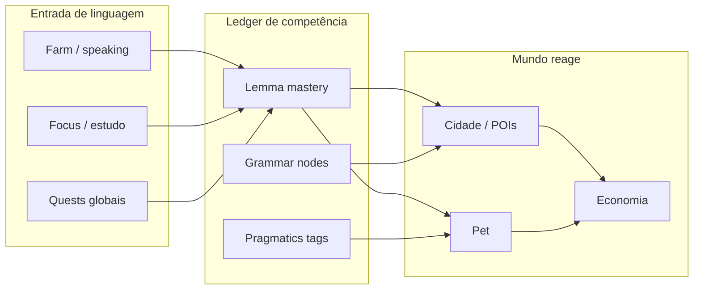

# English Quest — Aprendizado invisível (sistemas integrados)

Documento de **game design + learning science** para transformar o estudo de inglês em progressão inevitável do RPG — sem telas de “aula”, sem sensação de dever escolar.

> **Relacionados:** `[PRD.md](./PRD.md)`, `[FEATURES.md](./FEATURES.md)`, `[ENGLISH_LEARNING_ROADMAP.md](./ENGLISH_LEARNING_ROADMAP.md)` (GPS pedagógico — mundos CEFR, skills, plano diário), `[GAMIFICATION_SYSTEMS.md](./GAMIFICATION_SYSTEMS.md)` (retenção/meta), `[LIVING_CITY.md](./LIVING_CITY.md)` (cidade/POIs), farm/vocabulário, pet, contratos, `GameEvents`.

---

## Princípios transversais

| Princípio                    | Implicação de design                                                                                                                        |
| ---------------------------- | ------------------------------------------------------------------------------------------------------------------------------------------- |
| **Inevitabilidade**          | Nenhum marco importante (distrito, contrato épico, evolução do pet) avança só com moedas/XP genéricos — exige **uso demonstrado** do idioma |
| **Contexto antes de lista**  | Palavras aparecem como **ferramenta** (chave, insumo, evidência), não como cartão solto                                                     |
| **SRS embutido**             | Revisão = manutenção do mundo (muro cai, rumor espalha erro, pet “esquece” frase favorita)                                                  |
| **Reforço emocional**        | Acerto correto desbloqueia reação do pet, trust do NPC, clima da cidade — não só +10 XP                                                     |
| **Um ledger de competência** | SQLite guarda **domínio por lemma/skill** (reconhecimento → produção → uso em missão) alimentado por todos os sistemas                      |



---

## Índice dos sistemas

1. [Muro da Memória (Lexicon Brick)](#1-muro-da-memória-lexicon-brick)
2. [Chaves Semânticas de Distrito](#2-chaves-semânticas-de-distrito)
3. [Câmara de Eco do Companion](#3-câmara-de-eco-do-companion)
4. [Tribunal de Cláusulas (Gramática como contrato)](#4-tribunal-de-cláusulas-gramática-como-contrato)
5. [Grafite em Decaimento (SRS urbano)](#5-grafite-em-decaimento-srs-urbano)
6. [Kit de Frase no Inventário (crafting linguístico)](#6-kit-de-frase-no-inventário-crafting-linguístico)
7. [Prova Oral sob Pressão (speaking como recurso)](#7-prova-oral-sob-pressão-speaking-como-recurso)
8. [Cache dos Sonhos (revisão passiva noturna)](#8-cache-dos-sonhos-revisão-passiva-noturna)
9. [Clima de Registro (formal × casual na cidade)](#9-clima-de-registro-formal--casual-na-cidade)
10. [Livro de Evidências da Carreira](#10-livro-de-evidências-da-carreira)
11. [Rede de Rumores Lexicais](#11-rede-de-rumores-lexicais)
12. [Ressonância Emocional com NPCs](#12-ressonância-emocional-com-npcs)

---

## 1. Muro da Memória (Lexicon Brick)

> **Especificação completa:** [MEMORY_WALL_LEXICON_BRICK.md](./MEMORY_WALL_LEXICON_BRICK.md) — mecânica, dados, UX, fases e estado atual vs alvo.

### 1. Sistema (nome e mecânica)

**Nome:** Muro da Memória  
**Mecânica:** Cada palavra aprendida no farm vira um **tijolo lexicon** com metadados (lemma, CEFR, tema, última revisão). Tijolos não ficam numa lista — são **colocados** em obras da cidade (biblioteca, embassy, mural do parque). Obras têm **plantas** que exigem combinações (“12 bricks de travel + 5 de food”). Sem tijolos certos, a barra de obra do POI não avança, mesmo com moedas. Tijolos **envelhecem**: após N dias sem revisão, viram “rachados” e contam metade no progresso da obra até serem **reparados** (micro-sessão de 20–40s no local).

### 2. Como o inglês é aprendido

- **Aquisição:** farm/speaking cria o tijolo (reconhecimento + produção inicial).
- **Consolidação:** reparo no POI = recall ativo (digitar, escolher, falar) no contexto do tema da obra.
- **Transferência:** obra concluída desbloqueia missões locais que **só aceitam** vocabulário daquele muro (missões filtradas por `lemma_set`).

### 3. Conexão com outros sistemas

| Sistema        | Integração                                                                           |
| -------------- | ------------------------------------------------------------------------------------ |
| **Cidade**     | `city_poi_projects`, entregas, `visual_stage` — obra = progresso linguístico visível |
| **Farm**       | Fonte de tijolos; palavras temáticas de eventos (Natal) viram tijolos sazonais       |
| **Economia**   | Moedas aceleram obra, mas **não substituem** tijolos; evita pay-to-skip learning     |
| **Pet**        | Pet “carrega” tijolo até o POI (missão de entrega = caminhada + recall leve)         |
| **Inventário** | Tijolos raros (phrasal verbs) ocupam slot de “material de construção”                |

### 4. Retenção e hábito diário

- Obra semanal reinicia segunda — ritual “segunda da biblioteca”.
- Rachadura visível no mapa (mural escurece) puxa retorno antes do decay grave.
- Push opcional: “O muro da biblioteca precisa de 2 tijolos hoje”.

### 5. Evitar “estou estudando”

O jogador **constrói a cidade**, não “revisa deck 4”. UI mostra planta, NPC pedindo material, barra de obra — vocabulário é **insumo de urbanismo**, não lição.

---

## 2. Chaves Semânticas de Distrito

### 1. Sistema (nome e mecânica)

**Nome:** Chaves Semânticas  
**Mecânica:** Distritos e POIs têm **fechaduras semânticas**: para atravessar ou desbloquear (ex.: `airport_gate`, distrito internacional), o jogador precisa de **chaves** — conjuntos de domínio (“80% dos lemmas de travel B1”, “3 phrasal verbs de airport”). Chaves são obtidas ao completar **arcos de chain** no POI certo + prova final curta (boss sem combate: diálogo de 5 turnos). Chave equipada no perfil (slot único) abre atalhos no mapa.

### 2. Como o inglês é aprendido

- Mapa força **curriculo emergente** por região temática.
- Prova final exige **produção** (montar frase, escolher colocação) — não só múltipla escolha.
- SRS: chave **perde brilho** se lemmas do set caem abaixo do limiar de mastery (revisão no POI emissor).

### 3. Conexão com outros sistemas

| Sistema               | Integração                                                                 |
| --------------------- | -------------------------------------------------------------------------- |
| **Cidade**            | `requiredPlayerLevel` + chave; POIs `eventOnly` exigem chave sazonal       |
| **Chains narrativas** | Cada chain libera fragmento de chave (já existe `city_poi_chain_progress`) |
| **Contratos**         | Contratos em POIs bloqueados só aparecem com chave parcial                 |
| **Carreira**          | Vagas “remote US” exigem chave `work_visa`                                 |
| **Títulos**           | Título exibe chave ativa como “carimbo no passaporte”                      |

### 4. Retenção e hábito

- Metas claras no mapa (“Faltam 4 palavras para a chave do aeroporto”).
- FOMO saudável: evento de verão no `summer_plaza` exige chave `outdoor` — janela temporal.
- Revisão de chave = 1 interação ao abrir o app (manutenção leve).

### 5. Evitar “estou estudando”

É **exploração e desbloqueio de mapa** — mesma fantasia de Zelda/Metroidvania, onde a “chave” é competência lexical, não questionário numerado.

---

## 3. Câmara de Eco do Companion

### 1. Sistema (nome e mecânica)

**Nome:** Câmara de Eco  
**Mecânica:** O pet **imita** frases que o jogador usou com sucesso nas últimas 72h (pool limitado, priorizado por SRS). Sessão na “câmara” (quarto do pet / aba pet): o pet fala a frase com lacuna; o jogador completa por voz ou tap. Acerto = pet aprende **variante** (sinônimo, registro). Erro = pet fica “confuso” (cosmético + hint sem punir streak). **Eco duplo:** na cidade, NPCs citam frases que o pet já domina — reforço social.

### 2. Como o inglês é aprendido

- Recall espaçado ancorado em **frases reais do jogador**, não genéricas.
- Shadowing leve (speaking) com feedback por similaridade / escolha.
- Expansão lexical: variantes corretas entram no ledger como “família”.

### 3. Conexão com outros sistemas

| Sistema                              | Integração                                                              |
| ------------------------------------ | ----------------------------------------------------------------------- |
| **Pet**                              | Memórias (`pet-memory`) registram ecos bem-sucedidos como capítulo      |
| **Farm**                             | Palavras novas só entram no pool de eco após 1 uso bem-sucedido no farm |
| **Focus Mode**                       | Sessão de foco alimenta frases longas para eco noturno                  |
| **Cidade**                           | NPC trust sobe quando eco do pet coincide com tema do POI               |
| **Pacto de Ritmo** (GAMIFICATION #1) | Eco noturno só na fase “dormindo” — recompensa maior                    |

### 4. Retenção e hábito

- 2–3 min por sessão; ideal pós-estudo ou antes de dormir.
- Pet manda “lembrança” no diálogo se lemma está em risco de decay.
- Combo: eco + carinho = bônus de felicidade (não XP de aula).

### 5. Evitar “estou estudando”

É **brincar com o pet** que repete o que você disse — vínculo afetivo, não drill. Falha é “ele não entendeu”, não “nota 4”.

---

## 4. Tribunal de Cláusulas (Gramática como contrato)

### 1. Sistema (nome e mecânica)

**Nome:** Tribunal de Cláusulas  
**Mecânica:** Contratos deixam de ser só “complete N missões” — incluem **cláusulas gramaticais** negociáveis: tempo verbal, condicional, passive. O jogador monta a resposta certa em **turnos de diálogo** com o NPC emissor (UI de cartas de estrutura, não tabela gramatical). “Batalha” = persuasão: cada turno errado aumenta **risco** (multa de moedas, prazo menor); acerto reduz risco e aumenta recompensa. Boss de contrato = audiência na prefeitura com júri de NPCs (3 cláusulas encadeadas).

### 2. Como o inglês é aprendido

- Gramática como **ferramenta de negócio** (email, proposta, entrevista) — input significativo.
- Erro mostra consequência in-world (“o cliente desistiu”) + micro-explicação opcional **depois** do turno.
- Mesma estrutura reaparece em contratos futuros (spacing por `grammar_node_id`).

### 3. Conexão com outros sistemas

| Sistema       | Integração                                                |
| ------------- | --------------------------------------------------------- |
| **Contratos** | Estende `issuerPoiKey` + templates por carreira           |
| **NPC trust** | Cláusulas bem negociadas = +trust grande                  |
| **Economia**  | Multas e bônus de moedas; seguro consumível do inventário |
| **Carreira**  | Ramo “interview” exige tribunal de conditional            |
| **Chains**    | Arco da prefeitura desbloqueia modo tribunal              |

### 4. Retenção e hábito

- Um contrato ativo = um “caso” por semana — narrativa continua.
- Falha parcial ainda avança story (cláusula renegociada amanhã).
- Replay de cláusulas fracas aparece em rumor na cidade.

### 5. Evitar “estou estudando”

É **advogado do seu lado no RPG econômico** — gramática vira leverage, não exercício 7 da unidade 3.

---

## 5. Grafite em Decaimento (SRS urbano)

### 1. Sistema (nome e mecânica)

**Nome:** Grafite em Decaimento  
**Mecânica:** Palavras dominadas viram **grafites** nos muros do mapa (artefato visual por distrito). Decay SRS: grafite **desbota** (estágios 3→2→1→apagado). Apagado = rumor negativo naquele quarteirão (“ninguém fala inglês aqui”). Restaurar = missão de 30s no local: ouvir áudio, tap na palavra certa, ou ditado. Restauração em lote (3 grafites) = buff de vitalidade da cidade por 24h.

### 2. Como o inglês é aprendido

- Revisão espaçada **visual e geográfica** — você sabe _onde_ revisar.
- Áudio + reconhecimento + produção escalonados por estágio do grafite.
- Palavras “irmãs” restauram juntas se no mesmo cluster semântico.

### 3. Conexão com outros sistemas

| Sistema          | Integração                                                                 |
| ---------------- | -------------------------------------------------------------------------- |
| **Cidade**       | Vitalidade, rumores, overlay do mapa                                       |
| **Farm**         | Nova palavra cria grafite em POI temático correspondente                   |
| **Eventos**      | Grafites festivos (Natal) expiram com evento — última chance de consolidar |
| **Estatísticas** | Heatmap de decay por tema para o jogador                                   |

### 4. Retenção e hábito

- Mapa comunica urgência sem notificação agressiva.
- “Rota de restauração” diária sugerida (3 pins próximos).
- Streak de restauração separada da streak de estudo (reconciliação).

### 5. Evitar “estou estudando”

É **manutenção urbana / street art** — identidade do bairro, não Anki.

---

## 6. Kit de Frase no Inventário (crafting linguístico)

### 1. Sistema (nome e mecânica)

**Nome:** Kit de Frase  
**Mecânica:** Inventário guarda **tokens** (verb, noun, particle, tone) dropados de missões/farm. Missões e diálogos exigem **craft** de frase: arrastar tokens para slots (SVO + tone). Frase válida = progresso; frase excelente (sinônimo raro equipado) = bônus. Tokens quebrados (tempo verbal errado) “quebram” o craft — consumível de inventário conserta 1 slot. Limite de inventário força escolha de **deck ativo** (12 tokens) — deck é loadout, não lista infinita.

### 2. Como o inglês é aprendido

- Sintaxe e colocação por **composição**, não regra abstrata.
- Tom (formal/casual) como token — pragmática explícita mas lúdica.
- Tokens repetidos em crafts sobem tier (bronze → gold) = SRS por item.

### 3. Conexão com outros sistemas

| Sistema        | Integração                                                |
| -------------- | --------------------------------------------------------- |
| **Inventário** | Categoria `linguistic_token`; loot boxes raras            |
| **Missões**    | Dailies globais e locais aceitam craft em vez de checkbox |
| **Pet**        | Pet sugere token faltante (hint com custo de felicidade)  |
| **Loja**       | Vende token sideboard, não power pay-to-win               |
| **RPG**        | Skills desbloqueiam slots extras no craft                 |

### 4. Retenção e hábito

- Meta diária: “1 craft perfeito” para baú.
- Coleção de tokens = completionism saudável.
- Eventos introduzem tokens limitados (christmas tone).

### 5. Evitar “estou estudando”

É **montar poção/habilidade** em RPG — a frase é o feitiço, não a lição.

---

## 7. Prova Oral sob Pressão (speaking como recurso)

### 1. Sistema (nome e mecânica)

**Nome:** Prova Oral  
**Mecânica:** Certas ações críticas (embarque no aeroporto, entrevista de contrato, pedido no café) consomem **fichas de voz** — geradas ao praticar speaking no farm. Minigame: barra de pressão sobe com o tempo; jogador fala a frase-alvo; qualidade reduz pressão. Sem fichas, a ação **adiia** (NPC marca horário amanhã) — não hard block frustrante. Co-op com pet: pet “segura o microfone” (primeira tentativa sem pressão).

### 2. Como o inglês é aprendido

- Produção oral obrigatória nos gates certos — **inevitável** para progressão tier 2+.
- Repetição: mesmas estruturas em contextos diferentes (café vs aeroporto).
- Feedback imediato + NPC reage na hora (trust, emoção).

### 3. Conexão com outros sistemas

| Sistema              | Integração                                               |
| -------------------- | -------------------------------------------------------- |
| **Farm / speaking**  | Gera e recarrega fichas; qualidade afeta yield           |
| **Contratos / POIs** | Gates configuráveis por `requires_speaking`              |
| **Focus Mode**       | Sessão longa converte em ficha bônus                     |
| **Punishments**      | Falha grave em prova = debuff leve de reputação, não ban |

### 4. Retenção e hábito

- Agenda de NPC (“Sua entrevista é às 19h”) cria appointment.
- Fichas acumulam cap — incentiva uso regular, não hoarding infinito.
- Primeira prova do dia com bônus de season pass.

### 5. Evitar “estou estudando”

É **performance sob pressão de personagem** — audiência, não professor corrigindo.

---

## 8. Cache dos Sonhos (revisão passiva noturna)

### 1. Sistema (nome e mecânica)

**Nome:** Cache dos Sonhos  
**Mecânica:** Quando o pet está na fase **dormindo** (Pacto de Ritmo), o jogador pode iniciar **sonho lúcido** (≤45s): sequência de imagens da cidade/pet com palavras em overlay; tap na imagem certa quando ouve o áudio; ou confirmação “sim/não — essa frase faz sentido?”. Resultado grava **reforço SRS** sem gastar energia de missão. Limite: 1 sonho profundo + N micro-sonhos (ads opcionais / premium ético offline). Acordar = pet cita 1 palavra do sonho no diálogo do dia.

### 2. Como o inglês é aprendido

- Reconhecimento auditivo + associação imagem-palavra (dual coding).
- Baixa carga cognitiva — ideal para dias fracos (retenção sem fricção).
- Palavras do sonho priorizadas pelo algoritmo de decay do ledger.

### 3. Conexão com outros sistemas

| Sistema          | Integração                                               |
| ---------------- | -------------------------------------------------------- |
| **Pet**          | Fase dormindo; memória “sonhei com airport”              |
| **Notificações** | Lembrete noturno opcional, janela silenciosa             |
| **Cidade**       | Cenários do sonho = POIs visitados recentemente          |
| **Streak**       | Sonho conta como “toque mínimo” em dias de reconciliação |

### 4. Retenção e hábito

- Ritual noturno paralelo ao estudo diurno — **dupla ancora** no dia.
- Não substitui estudo ativo; yield 30–40% do SRS diurno.
- Sequência de 7 sonhos = skin do quarto.

### 5. Evitar “estou estudando”

É **cutscene interativa de sono** — relaxamento, não lição antes de dormir.

---

## 9. Clima de Registro (formal × casual na cidade)

### 1. Sistema (nome e mecânica)

**Nome:** Clima de Registro  
**Mecânica:** A cidade tem **clima pragmático** rotativo (Formal Monday, Casual Friday, Interview Storm…). Cada clima buffa um registro e **nerfa** outro nas interações: missões locais pedem tom compatível; NPCs rejeitam craft com tom errado (sem punição severa — pedido de reformular). Jogador equipa **guarda-roupa de tom** (3 slots) desbloqueados por títulos. Eventos sazonais forçam clima temático (Natal = warm casual + festive vocab).

### 2. Como o inglês é aprendido

- Pragmática e sociolinguística — **quando** usar forma, não só **o que** dizer.
- Contraste explícito entre pares (Hi vs Dear, gonna vs will) no mesmo tema.
- Repetição espaçada por par de registro no ledger.

### 3. Conexão com outros sistemas

| Sistema              | Integração                                  |
| -------------------- | ------------------------------------------- |
| **Cidade / eventos** | `mapThemeKey` + clima ligados               |
| **Kit de Frase**     | Token `tone` obrigatório em crafts no clima |
| **Carreira**         | Interview storm alinha com ramo career      |
| **Títulos**          | Desbloqueiam slots de guarda-roupa          |

### 4. Retenção e hábito

- Previsão semanal — jogador planeja “sexta casual” para café.
- Missão diária global referencia clima do dia.
- Comunidade interna (futuro) poderia comparar escolhas de tom — opcional.

### 5. Evitar “estou estudando”

É **dress code da cidade** — você se veste linguisticamente para o dia, como escolher armadura elemental.

---

## 10. Livro de Evidências da Carreira

### 1. Sistema (nome e mecânica)

**Nome:** Livro de Evidências  
**Mecânica:** Barra “% da cidade” / sonho de carreira **não sobe** com grind genérico — só com **evidências**: artefatos gerados ao usar inglês em contexto real (gravação de frase em contrato, craft perfeito, prova oral passada). Cada vaga no career tree exige N evidências de tipos específicos (technical interview, small talk, email formal). Evidências são carimbos no passaporte — visíveis para NPCs (diálogo extra).

### 2. Como o inglês é aprendido

- Progressão de carreira = **portfólio de competência**, não level sink.
- Força diversidade de skills (speaking + writing + listening).
- Revisita: evidência “envelhece” — renovar com missão similar (SRS de performance).

### 3. Conexão com outros sistemas

| Sistema                  | Integração                                         |
| ------------------------ | -------------------------------------------------- |
| **Career / metagame**    | Substitui métrica vaga por checklist de evidências |
| **Contratos / tribunal** | Maior fonte de evidências formais                  |
| **Cidade**               | % cidade deriva de evidências + obras              |
| **Prestígio**            | Reset mantém evidências “lendárias” encadernadas   |

### 4. Retenção e hábito

- Meta de longo prazo clara (“faltam 2 evidências de listening”).
- Semanal: evidência bônus do season pass.
- Compartilhamento export PDF offline (futuro) — orgulho.

### 5. Evitar “estou estudando”

É **currículo gamificado** — você coleciona provas de que fala inglês, não pontos de quiz.

---

## 11. Rede de Rumores Lexicais

### 1. Sistema (nome e mecânica)

**Nome:** Rede de Rumores Lexicais  
**Mecânica:** Rumores da cidade (já existe vitalidade/rumor) passam a carregar **erro lexical** ou **lacuna**: “O café só atende quem sabe ”. Corrigir = levar lemma certo ao POI (visita + micro-interação) ou craft de frase no kit. Rumor verdadeiro espalha buff local; rumor falso se propaga se ignorado (debuff leve 48h). Jogador pode **plantar** rumor verdadeiro após dominar tema (social proof — bônus de trust em cadeia).

### 2. Como o inglês é aprendido

- Recall em contexto social; listening reading integrado no texto do rumor.
- Distinguir falso cognate / erro comum — negociação de significado.
- Spacing: mesmo rumor retorna com lemma diferente após intervalo.

### 3. Conexão com outros sistemas

| Sistema                             | Integração                                             |
| ----------------------------------- | ------------------------------------------------------ |
| **Cidade viva**                     | `activeRumor`, vitalidade, NPC flavor                  |
| **Gossip graph** (GAMIFICATION #10) | Camada social entre POIs                               |
| **Farm**                            | Lemma necessário destacado se já estudado mas em decay |
| **Pet**                             | Pet “ouviu fofoca” — hint para POI certo               |

### 4. Retenção e hábito

- Curiosidade — jogador quer saber o desfecho do rumor.
- Loop curto (2–3 min) para quem não tem tempo de missão longa.
- Rumor diário à meia-noite local (seed determinístico offline).

### 5. Evitar “estou estudando”

É **fofoca da vizinhança** — investigação social, não gap-fill worksheet.

---

## 12. Ressonância Emocional com NPCs

### 1. Sistema (nome e mecânica)

**Nome:** Ressonância Emocional  
**Mecânica:** Além de `npc_trust`, cada NPC tem **eixo de ressonância** (warmth, respect, humor). Palavras e tons têm tags emocionais. Usar lexical choice alinhada ao eixo do NPC em chains/contratos/disparos de diálogo preenche barra de ressonância — desbloqueia linhas de diálogo, descontos na loja do POI, easter eggs. Desalinhamento não falha — NPC responde “estranho” e pede reformulação (aprendizado por feedback social). Pico de ressonância = cena curta (reward emocional + item cosmético).

### 2. Como o inglês é aprendido

- Conotação e adequação afetiva — inglês “vivo”.
- Repetição de pares palavra–emoção com NPC específico (spacing por NPC).
- Listening: entonação sugerida em áudio do NPC antes da resposta.

### 3. Conexão com outros sistemas

| Sistema                | Integração                                            |
| ---------------------- | ----------------------------------------------------- |
| **NPC trust** (Fase 7) | Trust = consistência; ressonância = qualidade afetiva |
| **Chains**             | Passos exigem ressonância mínima                      |
| **Loja / economia**    | Descontos locais, não global                          |
| **Pet**                | Pet comenta “você foi gentil com Sam” — reforço moral |

### 4. Retenção e hábito

- Relacionamento por personagem — volta para ver o NPC.
- Eventos sazonais mudam eixos (Natal = warmth).
- Diário de ressonância (1 frase) no log do jogador.

### 5. Evitar “estou estudando”

É **dating sim / social RPG light** — você escolhe palavras que soam certas para _aquela_ pessoa.

---

## Matriz de integração (visão rápida)

| Sistema               | Pet     | Cidade     | Economia      | Quests            | Inventário | Farm/SRS | Contratos |
| --------------------- | ------- | ---------- | ------------- | ----------------- | ---------- | -------- | --------- |
| Muro da Memória       | entrega | ★★★        | moedas + obra | missões filtradas | material   | ★★★      | —         |
| Chaves Semânticas     | —       | ★★★        | —             | chains            | loadout    | ★★       | ★         |
| Câmara de Eco         | ★★★     | NPC cita   | —             | —                 | —          | ★★       | —         |
| Tribunal de Cláusulas | —       | prefeitura | multa/bônus   | —                 | seguro     | ★        | ★★★       |
| Grafite Decaimento    | —       | ★★★        | buff VIT      | micro             | —          | ★★★      | —         |
| Kit de Frase          | hint    | missão     | loja tokens   | ★★★               | ★★★        | ★★       | diálogo   |
| Prova Oral            | co-op   | gates      | —             | —                 | —          | ★★★      | ★★        |
| Cache dos Sonhos      | ★★★     | cenário    | —             | streak mín.       | —          | ★★       | —         |
| Clima de Registro     | —       | ★★★        | —             | ★★                | tom        | ★        | ★         |
| Livro de Evidências   | —       | % cidade   | —             | —                 | —          | ★★       | ★★★       |
| Rumores Lexicais      | hint    | ★★★        | debuff        | micro             | —          | ★★       | —         |
| Ressonância NPC       | comenta | ★★★        | loja POI      | chains            | —          | ★★       | ★★        |

---

## Ledger de competência (fundação técnica sugerida)

Para todos os sistemas acima funcionarem integrados, uma tabela (ou conjunto) offline:

```text
lemma_mastery (
  lemma_id, recognition_score, production_score,
  last_review_at, next_review_at, contexts_seen[], decay_stage
)
grammar_node_mastery (
  node_id, exposure_count, success_streak, last_error_type
)
pragmatics_tag_mastery (
  tag_id, register, npc_affinities json
)
```

**GameEvents** que alimentam o ledger (extensão natural do bus atual):

- `WORDS_LEARNED`, `SPEAKING_SESSION_COMPLETED` → production/recognition
- `LOCAL_MISSION_COMPLETED`, `POI_CHAIN_STEP_CLAIMED` → context_seen
- `CONTRACT_COMPLETED` → grammar_node
- Novos: `LEMMA_DECAYED`, `RESONANCE_PEAK`, `GRAFFITI_RESTORED`, `DREAM_CACHE_REVIEWED`

---

## Ordem de implementação sugerida (produto)

| Fase | Sistemas                                    | Por quê                                               |
| ---- | ------------------------------------------- | ----------------------------------------------------- |
| A    | Muro da Memória + Grafite                   | Já existe lexicon/obras/cidade — maior ROI pedagógico |
| B    | Câmara de Eco + Cache dos Sonhos            | Pet + SRS com baixo escopo de UI                      |
| C    | Chaves Semânticas + Rumores Lexicais        | Aprofunda mapa e chains existentes                    |
| D    | Kit de Frase + Clima de Registro            | Camada de crafting pragmático                         |
| E    | Tribunal + Prova Oral + Livro de Evidências | Gates avançados para jogadores mid/late               |

---

## Métricas de sucesso (não vanity)

- **Tempo até primeira produção oral** (dias) — deve cair sem aumentar churn.
- **% missões cidade completadas com lemma exigido** vs skip.
- **Decay recovery rate** — jogadores restauram grafites/tijolos antes do apagado total.
- **Retenção D7/D30** correlacionada com ≥3 sistemas tocados por semana (não só daily checkbox).
- **Autopercepção** (in-app 1 pergunta quinzenal): “Senti que estudei” vs “Senti que joguei” — meta: ≥70% “joguei” com progresso lexical objetivo no ledger.

---

_Documento de design — maio/2026. Complementa `GAMIFICATION_SYSTEMS.md` (loops de retenção) com foco em aquisição e retenção linguística invisível._
