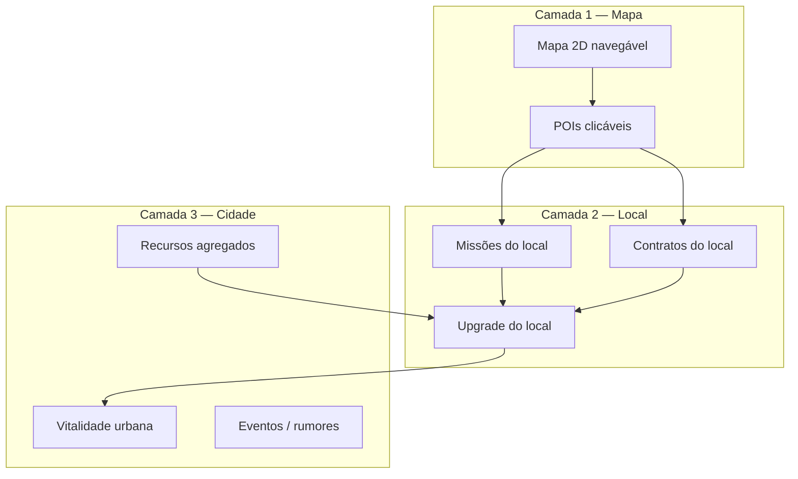

# Cidade Viva — Mapa, locais, missões e contratos

Documento de **mapeamento de produto e design de sistemas** para a evolução da funcionalidade de cidade no English Quest. Esta feature será grande; este arquivo é a referência única antes da implementação.

> **Relacionados:** [`FEATURES.md`](./FEATURES.md) (city atual), [`GAMIFICATION_SYSTEMS.md`](./GAMIFICATION_SYSTEMS.md) (ideia #3 Lexicon → cidade), [`INVISIBLE_LEARNING_SYSTEMS.md`](./INVISIBLE_LEARNING_SYSTEMS.md) (inglês integrado ao mapa/pet), contratos em `src/features/contracts/`, skyline em `src/features/city/`.

---

## Índice

1. [Visão](#visão)
2. [Problema do sistema atual](#problema-do-sistema-atual)
3. [Conceito: Cidade Viva](#conceito-cidade-viva)
4. [Pilares de design](#pilares-de-design)
5. [Mapa e navegação](#mapa-e-navegação)
6. [Locais (POIs)](#locais-pois)
7. [Estado e evolução da cidade](#estado-e-evolução-da-cidade)
8. [Missões por local](#missões-por-local)
9. [Contratos por local](#contratos-por-local)
10. [Recursos da cidade (Lexicon e insumos)](#recursos-da-cidade-lexicon-e-insumos)
11. [Calendário de eventos da cidade](#calendário-de-eventos-da-cidade)
12. [Cidade viva contínua (camada sempre ligada)](#cidade-viva-contínua-camada-sempre-ligada)
13. [Integração com outros sistemas](#integração-com-outros-sistemas)
14. [Modelo de dados (rascunho)](#modelo-de-dados-rascunho)
15. [Eventos GameEvents](#eventos-gameevents)
16. [UX e telas](#ux-e-telas)
17. [Economia e balanceamento](#economia-e-balanceamento)
18. [Migração do city atual](#migração-do-city-atual)
19. [Fases de implementação](#fases-de-implementação)
20. [Riscos e decisões em aberto](#riscos-e-decisões-em-aberto)

---

## Visão

O jogador passa a ter uma **cidade navegável em mapa** — não só um skyline de progresso. Cada **local** (prefeitura, biblioteca, café, coworking, etc.) oferece **missões** contextualizadas e **contratos** emitidos por aquele lugar. A cidade **melhora visualmente e mecanicamente** conforme o jogador cumpre missões, entrega contratos e investe recursos (moedas, Study Points, **lexicon bricks**).

**Fantasia:** “Minha cidade internacional cresce porque eu estudo inglês de verdade — e ela **muda com o calendário**: no Natal tem mercado de Natal, missões com palavras festivas, contratos de fim de ano na prefeitura.”

**Mundo vivo** = mapa + POIs + **eventos programados** (Natal, Halloween, verão…) + sinais reativos ao comportamento do jogador — tudo em camadas, controlado por catálogo.

**Objetivos de produto:**

| Objetivo              | Como a cidade viva entrega                                |
| --------------------- | --------------------------------------------------------- |
| Retenção diária       | Rotina por local (“hoje passo na biblioteca”)             |
| Aprendizado invisível | Missões são tarefas da cidade, não “lição 12”             |
| Progressão constante  | Nível do bairro, obra, NPC satisfeito                     |
| Vínculo emocional     | Pet visita locais; cidade reage ao cuidado                |
| Sistemas emergentes   | Contrato na padaria + brick na biblioteca + rumor no café |

---

## Problema do sistema atual

Hoje (`src/features/city/`):

- **Skyline + timeline** de edifícios desbloqueados por **nível do jogador**.
- Construção intermediária custa moedas + SP (`city-service`).
- **Sem mapa**, sem “ir até” um lugar, sem missões por edifício.
- **Contratos** são globais (`/contracts`), sem vínculo com um comércio ou NPC do mapa.
- Carreira usa `% da cidade` como métrica de sonho, mas a cidade não é um lugar jogável.

A Cidade Viva **evolui** esse módulo; não descarta necessariamente o conceito de marcos por nível (podem virar **desbloqueio de distrito** no mapa).

---

## Conceito: Cidade Viva

Três camadas sobrepostas:



1. **Mapa** — onde o jogador escolhe onde ir.
2. **Local** — o que fazer naquele ponto (missões, contrato, upgrade).
3. **Cidade** — agregado (beleza, prosperidade, desbloqueios globais).

---

## Pilares de design

1. **Lugar antes de lista** — Contratos e missões têm endereço no mapa, não só entrada em menu.
2. **Progressão local + global** — Biblioteca nível 3 ajuda a cidade; cidade nível 2 desbloqueia aeroporto no mapa.
3. **Estudo = obra** — Completar missão alimenta barra de “obra” do local (visual + mecânico).
4. **Um contrato ativo, um emissor** — Mantém foco; emissor = POI que ofereceu o contrato (NPC do local).
5. **Offline-first** — Estado em SQLite; mapa é projeção dos dados, não servidor.
6. **Integração Lexicon (ideia #3)** — Palavras do farm viram insumo para upgrades e missões específicas da biblioteca / embassy.
7. **Calendário com controle fino** — Eventos em catálogo (datas, POIs, vocabulário temático, contratos); janelas por data local; override de debug para QA.

---

## Mapa e navegação

### Rota principal

- **`/city`** (ou `/city-map`) — tela cheia do **mapa da cidade**.
- Subrota opcional: **`/city/[poiKey]`** — detalhe do local (sheet ou tela).

### Layout do mapa (conceito UX)

- Vista **isométrica ou top-down estilizada** (ilustração estática por fase + hotspots).
- **Distritos** desbloqueados progressivamente (Centro, Estudos, Negócios, Internacional).
- POIs aparecem como pins / prédios com:
  - ícone do tipo de local;
  - badge: missão disponível, contrato ativo, upgrade pronto;
  - nível do local (1–5 estrelas ou barra pequena).
- **Pet** pode aparecer no mapa na última local visitada (opcional fase 2).

### Interação

| Gesto          | Ação                                                         |
| -------------- | ------------------------------------------------------------ |
| Toque no POI   | Abre painel do local                                         |
| Pinch / scroll | Navegar mapa se maior que viewport                           |
| Filtro rápido  | “Missões”, “Contratos”, “Upgrades” — destaca POIs relevantes |

### Desbloqueio de área

- Distrito **travado**: neblina + requisito visível (nível jogador, contrato na prefeitura, X% cidade global).
- Distrito **ativo**: todos POIs base visíveis; alguns POIs ainda fechados por nível do local.

---

## Locais (POIs)

### Tipos de local (`PoiCategory`)

| Categoria   | Exemplos                           | Função principal                         |
| ----------- | ---------------------------------- | ---------------------------------------- |
| `civic`     | Prefeitura, Praça                  | Meta-cidade, contratos longos, season    |
| `education` | Biblioteca, Escola de idiomas      | Lexicon, revisão, missões de vocabulário |
| `commerce`  | Café, Padaria, Loja                | Contratos curtos, moedas, itens          |
| `work`      | Coworking, Escritório, Startup hub | Contratos médios, foco, carreira         |
| `culture`   | Museu (season), Teatro             | Coleção, cosméticos, legado              |
| `travel`    | Aeroporto, Embassy                 | Contratos longos, carreira internacional |
| `social`    | Parque                             | Pet, felicidade urbana, missões leves    |

### Catálogo inicial sugerido (MVP do mapa)

| `poiKey`          | Nome (PT)             | Categoria | Distrito      | Desbloqueio inicial           |
| ----------------- | --------------------- | --------- | ------------- | ----------------------------- |
| `town_hall`       | Prefeitura            | civic     | Centro        | Nível 1                       |
| `central_library` | Biblioteca Central    | education | Centro        | Nível 1                       |
| `study_cafe`      | Café do Estudo        | commerce  | Centro        | Nível 1                       |
| `corner_shop`     | Mercadinho            | commerce  | Centro        | Nível 3                       |
| `coworking_hub`   | Coworking             | work      | Negócios      | Nível 5                       |
| `language_lab`    | Lab de Idiomas        | education | Estudos       | Nível 8                       |
| `city_park`       | Parque                | social    | Estudos       | Nível 5                       |
| `embassy_row`     | Embaixada / Consulado | travel    | Internacional | Nível 20 + distrito           |
| `airport_gate`    | Aeroporto             | travel    | Internacional | Nível 30 + distrito           |
| `season_museum`   | Museu da Temporada    | culture   | Centro        | Após 1º season tier resgatado |

Cada POI tem: `name`, `description`, `icon`, `position` (x, y no mapa), `districtKey`, `maxLocalLevel`.

### NPC por local

- Um **personagem âncora** por POI (nome + emoji/avatar).
- Linha de diálogo muda com: nível do local, trust de contrato, rumor ativo, pet visitou hoje.
- Contrato ativo mostra NPC na prefeitura ou no POI emissor com indicador “aguardando você”.

---

## Estado e evolução da cidade

### Nível do local (`localLevel` 1–5)

Sobe com **XP local** ganho ao:

- Completar missões daquele POI;
- Progressar dias em contrato emitido pelo POI;
- Entregar upgrade com recursos.

**Efeitos por nível (exemplo):**

| Nível | Visual                     | Mecânico                                      |
| ----- | -------------------------- | --------------------------------------------- |
| 1     | Prédio simples             | 1 missão/dia do local                         |
| 2     | Faixa “em obras” concluída | +5% recompensa nas missões do POI             |
| 3     | Luminária / placa          | Desbloqueia 1 contrato tier 2                 |
| 4     | Animação leve (bandeira)   | Missão semanal exclusiva do POI               |
| 5     | Landmark                   | Passivo global fraco (+loot luck no distrito) |

### Vitalidade da cidade (`cityVitality` 0–100)

Agregado de todos os locais + dias estudados na semana:

- **Alta:** bônus leve em `RewardModifierService`, pet feliz ao visitar parque.
- **Baixa:** preços sobem no mercadinho, diálogos secos (ligação futura com _care debt_ / rumores).

### Distritos (`districtKey`)

| Distrito         | Temática           | Desbloqueio sugerido                    |
| ---------------- | ------------------ | --------------------------------------- |
| `downtown`       | Centro, serviços   | Início                                  |
| `study_lane`     | Educação, parque   | Nível 5 ou 1º contrato completo         |
| `business_row`   | Trabalho           | Nível 10                                |
| `global_quarter` | Embassy, aeroporto | Nível 20 + 40% POIs do centro ≥ nível 2 |

### Relação com skyline atual

- Edifícios **House → Financial Center** podem mapear para **marcos de distrito** ou **silhueta de fundo** do mapa que muda conforme `cityVitality` / nível global.
- `BUILDING_DEFINITIONS` existentes: migrar para `district_milestone` ou manter skyline como “cartão postal” na aba Resumo.

---

## Missões por local

### O que são

Missões **contextuais ao POI**, diferentes das dailies globais (`/quests`):

- **Daily do local** — 1–3 por POI por dia; reset com `getTodayKey()`.
- **Chain do local** — sequência de 3–7 missões narrativas (“Biblioteca: do catálogo ao empréstimo”).
- **Obra / projeto** — barra de progresso de vários dias (ex.: “Reformar a praça” — 5 entregas de bricks).

### Tipos de objetivo (`LocalMissionType`)

| Tipo                    | Exemplo                         | Fonte de progresso           |
| ----------------------- | ------------------------------- | ---------------------------- |
| `complete_daily_global` | “Finalize 1 missão diária hoje” | `DAILY_MISSION_COMPLETED`    |
| `study_day`             | “Registre estudo hoje”          | `STUDY_DAY_RECORDED`         |
| `focus_session`         | “Complete 1 sessão de foco”     | `FOCUS_SESSION_COMPLETED`    |
| `deliver_bricks`        | “Entregue 20 lexicon bricks”    | Inventário / farm            |
| `pet_visit`             | “Visite o parque com o pet”     | Interação no POI + pet       |
| `speaking_units`        | “Pratique speaking (farm)”      | `SPEAKING_SESSION_COMPLETED` |

### Recompensas

- Moedas, XP, **XP local do POI**, season points, bricks, loot box rara (níveis altos).
- Nunca punir severamente por falha — missão local expira no dia, nova amanhã.

### Geração

- Pool por `poiKey` + `localLevel` + dificuldade do app.
- Template keys reutilizáveis (`library_vocab_01`, `cafe_streak_check_in`).

---

## Contratos por local

### Mudança em relação ao hoje

| Hoje                           | Cidade Viva                                    |
| ------------------------------ | ---------------------------------------------- |
| Lista em `/contracts`          | Contratos **oferecidos por POI** no mapa       |
| `contractKey` global           | `contractKey` + **`issuerPoiKey`** obrigatório |
| Mesma UI para todos            | Card do NPC do café, padaria, prefeitura       |
| Trust (futuro GAMIFICATION #4) | Trust com **NPC daquele POI**                  |

### Fluxo

1. Jogador abre POI (ex.: Coworking).
2. Aba **Contratos** lista 1–3 contratos disponíveis (desbloqueados por `localLevel` + nível jogador).
3. Aceitar contrato → `ACTIVE`, `issuerPoiKey` gravado, aposta em moedas.
4. Progresso por **dias de estudo** (igual hoje) + opcional **missões do local** como bônus de progresso (+0.5 dia).
5. Concluir → recompensas + **XP local** grande + evento `CONTRACT_COMPLETED` + season points.
6. Falhar → trust do POI cai; outros POIs do mesmo distrito podem comentar.

### Catálogo

- Migrar `CONTRACT_DEFINITIONS` para incluir `issuerPoiKey` e `districtKey`.
- Exemplos:
  - `consistency_starter` → **Prefeitura** ou **Café**
  - `weekly_focus` → **Coworking**
  - `commitment_master` → **Embassy**

### Regra: um contrato ativo

- Mantida.
- UI do mapa destaca POI emissor com pulse.
- Cancelar contrato (se existir no futuro) só no POI emissor.

---

## Recursos da cidade (Lexicon e insumos)

Integração direta com [GAMIFICATION_SYSTEMS.md — ideia #3](./GAMIFICATION_SYSTEMS.md#3-lexicon-como-recurso-da-cidade). Evolução lexical (tijolos por palavra, plantas, decay): [MEMORY_WALL_LEXICON_BRICK.md](./MEMORY_WALL_LEXICON_BRICK.md).

### Insumos (`CityResourceType`)

| Recurso            | Fonte principal              | Uso principal                 |
| ------------------ | ---------------------------- | ----------------------------- |
| `lexicon_brick`    | `WORDS_LEARNED` (farm)       | Biblioteca, upgrades educação |
| `fluency_cement`   | `SPEAKING_SESSION_COMPLETED` | Embassy, aeroporto            |
| `consistency_wood` | Dailies / dias de estudo     | Prefeitura, parque, obras     |
| `coin`             | Economia existente           | Comércios, acelera obra       |
| `study_point`      | Farm / loot                  | Upgrades tier 4+              |

### Entregas

- Painel do POI mostra **pedido da semana** (“Biblioteca precisa de 40 bricks”).
- Botão **Entregar** debita inventário cidade (não bag do jogador — tabela `city_resources`).
- Barra de obra do POI sobe; ao completar → nível local ou visual.

### Por que fica “invisível”

O jogador vê: “A biblioteca está expandindo”. O farm continua sendo “aprender palavras”, mas cada palavra vira brick automaticamente (taxa configurável).

---

## Calendário de eventos da cidade

Camada de **controle editorial** que transforma a cidade num mundo que respira o tempo real: festas, estações, micro-eventos de fim de semana. Diferente do **season pass** (metagame mensal genérico), eventos da cidade são **experiências temáticas no mapa** com vocabulário, missões, contratos, decoração e NPCs dedicados.

### Princípio: camadas empilhadas

```text
[ Base ]     POIs, distritos, missões rotineiras, contratos permanentes
[ Evento ]   Overlay ativo só entre startAt–endAt (ex.: Natal 1–26 dez)
[ Reativo ]  Rumores, vitality, “sumiu 2 dias” (seção seguinte)
```

O jogador **sempre** tem a cidade base; durante Natal, pins ganham guirlanda, missões normais podem ser **substituídas ou complementadas** por missões `eventTag: christmas`.

### O que um evento controla (`CityEventDefinition`)

| Dimensão        | Controle                                               | Exemplo Natal                                        |
| --------------- | ------------------------------------------------------ | ---------------------------------------------------- |
| **Janela**      | `startRule` / `endRule` (data local, recorrente anual) | 01/dez 00:00 → 26/dez 23:59                          |
| **Mapa**        | `mapThemeKey`, decorações por distrito, BGM (fase 2)   | Neve leve no centro, luzes                           |
| **POIs**        | Quais locais participam; skins `visualStageEvent`      | Padaria → “Bakery & Cocoa”; Praça → mercado de Natal |
| **Vocabulário** | Pacote `vocabPackKey` ligado ao farm                   | 40 palavras: mistletoe, stocking, carol…             |
| **Missões**     | Pool `eventMissions[]` por POI                         | Biblioteca: “Aprenda 5 palavras de Natal”            |
| **Contratos**   | Pool `eventContracts[]` + emissor POI                  | Prefeitura: “12 dias de presença no Advento”         |
| **Recursos**    | Insumo temático opcional                               | `festive_brick` além de lexicon_brick                |
| **Loot / loja** | Tabela de drops e SKUs temporários                     | Chapéu de Natal pro pet; booster “Eggnog XP”         |
| **NPC copy**    | Diálogos por `dialoguePackKey`                         | Café: “Want a gingerbread latte?”                    |
| **Progresso**   | Trackers globais do evento                             | “Espírito natalino 0–100”                            |
| **Prioridade**  | `major` vs `minor`                                     | 1 major ativo; minors podem empilhar                 |

Catálogo sugerido: `src/features/city/catalogs/city-events-catalog.ts` (versionado no bundle, como contratos e itens).

### Motor de agenda (`CityEventScheduler`)

Responsabilidades:

1. Na abertura do app / hydrate: `getActiveCityEvents(now, timezone)`.
2. Resolver conflitos: se dois `major` colidem, vence `priority` ou o mais específico.
3. Emitir `CITY_EVENT_STARTED` / `CITY_EVENT_ENDED` na transição de janela.
4. Persistir `lastSeenEventKey` para não repetir intro cinematic.
5. **Debug / QA:** override em dev menu (`forceEvent: christmas_2026`).

Regras de recorrência:

| Tipo               | Uso                                                           |
| ------------------ | ------------------------------------------------------------- |
| `fixed_annual`     | Natal, Halloween (mesmo dia todo ano)                         |
| `floating_weekend` | “Feira de idiomas” 1º fim de semana do mês                    |
| `one_shot`         | Aniversário do app (data fixa no catálogo)                    |
| `player_local`     | Opcional futuro: “seu Natal” 7 dias após 1º login de dezembro |

### Vocabulário temático (aprendizado invisível)

Cada evento declara um **`VocabPack`**:

```typescript
// Conceito — não é código final
type VocabPack = {
  key: "christmas_2026";
  words: Array<{ term: string; translation: string; example: string }>;
  farmIntegration: "override" | "append" | "weighted_mix";
  brickConversion: number; // palavras do pack → festive_brick ou lexicon_brick
};
```

**Fluxo Natal:**

1. Durante o evento, sessões de farm priorizam (ou misturam) palavras do pack.
2. Cada palavra aprendida conta para missões do POI (“Aprenda 3 palavras: reindeer, wreath, chimney”).
3. UI mostra progresso no detalhe do POI e chip no mapa: “🎄 12/40 palavras de Natal”.
4. Ao completar o pack → conquista + decoração permanente leve na praça (cosmético cidade).

Isso dá o **nível de controle** pedido: designers editam JSON do pack + missões que referenciam `vocabPackKey` + `minWordsLearned`.

### Missões de evento

Extensão de `city_poi_missions` com campos:

- `eventKey` (nullable = missão rotineira)
- `priority` — evento substitui daily do POI se `replaceRoutine: true`
- `objectives[]` — suporta compostos: “3 palavras Natal” + “1 sessão foco” + “visite praça”

**Tipos exclusivos de evento:**

| Tipo                   | Descrição                                             |
| ---------------------- | ----------------------------------------------------- |
| `learn_event_vocab`    | N palavras do pack                                    |
| `event_poi_chain`      | Sequência narrativa 3–5 passos no mesmo POI           |
| `city_wide_collection` | Entregar `festive_brick` na praça                     |
| `photo_with_pet_event` | Pet com acessório temático no parque                  |
| `attend_ceremony`      | “Cerimônia de abertura” na prefeitura (1x por evento) |

### Contratos de evento

Contratos com `eventKey` obrigatório; só listados no POI emissor durante a janela.

**Exemplo — Prefeitura, Natal:**

| Campo      | Valor                                                           |
| ---------- | --------------------------------------------------------------- |
| Nome       | Advent Study Pact                                               |
| Objetivo   | Estudar 12 dias em dezembro (não precisa consecutivo)           |
| Emissor    | `town_hall`                                                     |
| Aposta     | 80 moedas                                                       |
| Recompensa | Loot épica natalina + título limitado + 200 festive spirit      |
| Falha      | Sem blacklist longa — apenas perde aposta e NPC triste no Natal |

**Exemplo — Padaria, Natal:**

| Campo      | Valor                                     |
| ---------- | ----------------------------------------- |
| Nome       | Holiday Rush                              |
| Objetivo   | 5 dias consecutivos + 10 palavras do pack |
| Emissor    | `corner_shop`                             |
| Recompensa | Moedas + skin de vitrine natalina no POI  |

Regra: **no máximo 1 contrato de evento ativo** por vez (ou slot separado do contrato “normal” — decisão em aberto).

### Exemplo completo: evento `christmas_2026`

**Narrativa:** A cidade monta o Winter Market na praça; o jogador ajuda comércios e biblioteca a se prepararem para receber visitantes internacionais.

**Mapa:**

- Overlay neve parallax leve no distrito Centro.
- POI temporário **`winter_market`** (spawn só no evento) entre praça e café.
- Pins com badge 🎄.

**POIs e papéis:**

| POI               | Papel no Natal                                                     |
| ----------------- | ------------------------------------------------------------------ |
| `town_hall`       | Contrato Advent; missão “Acender luzes da praça”                   |
| `central_library` | Missões de vocabulário + entrega de livros infantis (bricks)       |
| `study_cafe`      | Diálogos sobre “holiday drinks”; missão foco 15 min                |
| `corner_shop`     | Contrato Holiday Rush; venda de itens temáticos na loja local      |
| `city_park`       | Pet com gorro; missão foto                                         |
| `winter_market`   | Hub: 3 missões diárias rotativas + troca de festive_brick por loot |

**Vocabulário (amostra do pack):** gingerbread, mistletoe, stocking, reindeer, carol, fireplace, ornament, sleigh, elves, chimney, wreath, eggnog.

**Progresso global do evento — “Espírito natalino”:**

- 0–100; ganha ao fazer missões/contratos do evento.
- Marcos: 25 = skin mapa; 50 = booster; 75 = loot rara; 100 = colecionável ultra-raro no museu.

**Pós-evento:**

- POIs voltam skin normal; `winter_market` desaparece.
- Histórico em `city_event_history` — “Natal 2026: 100% espírito”.
- Colecionável permanente se atingiu marco 100.

### Calendário anual sugerido (roadmap de conteúdo)

| `eventKey`        | Janela (BR)    | Tema                             |
| ----------------- | -------------- | -------------------------------- |
| `new_year`        | 27 dez – 7 jan | Resoluções, goals, “fresh start” |
| `valentine_study` | 10–16 fev      | Convites, friendship vocabulary  |
| `carnival`        | fev/mar móvel  | Cores, parade, speaking          |
| `earth_week`      | 1ª semana abr  | Sustentabilidade, city park      |
| `summer_fair`     | jul–ago        | Aeroporto, travel English        |
| `halloween`       | 20 out – 2 nov | Spooky vocab, biblioteca à noite |
| `thanksgiving`    | 4ª quinta nov  | Food, family (EN-US)             |
| `christmas`       | 1–26 dez       | Pacote principal                 |
| `app_anniversary` | data fixa      | Celebração meta, legado          |

Eventos `minor` (48–72h): “Book fair”, “Job fair na embassy”, “Pet adoption day” no parque.

### UX de evento

**No mapa:**

- Banner no topo: “🎄 Winter in [Nome da Cidade] — 12 dias restantes”.
- Botão **“Evento”** abre painel com progresso, missões hub, vocabulário 40/40.

**No detalhe do POI:**

- Aba **Evento** (só se ativo) com missões e contratos temáticos.
- Rotina continua na aba **Dia a dia** se `replaceRoutine: false`.

**Intro (1x por evento):**

- Modal curto + pan no mapa para `winter_market` ou prefeitura.

### Relação com season pass (metagame)

|             | Season pass         | Evento da cidade              |
| ----------- | ------------------- | ----------------------------- |
| Duração     | Mês calendário      | Janela temática (ex. 26 dias) |
| Progresso   | Pontos de temporada | Espírito do evento + palavras |
| Recompensas | Tiers genéricos     | Cosméticos + narrativa local  |
| Onde        | `/metagame`         | **Mapa `/city`**              |

Podem **sinergizar**: season pass dá +20% espírito natalino; museu da temporada ganha sala decorada durante Natal.

### Conteúdo e pipeline (como vocês controlam)

1. Designer edita `city-events-catalog.ts` + `vocab-packs/christmas_2026.json`.
2. Missões referenciam `templateKey` + `eventKey`.
3. QA força evento no dev menu.
4. Release do app traz novos eventos (sem OTA obrigatório no MVP); **OTA de catálogo** opcional fase futura.
5. Métricas locais: `city_event_analytics` (participação, palavras aprendidas).

---

## Cidade viva contínua (camada sempre ligada)

Além dos eventos programados, comportamentos **reativos** (sem servidor; derivados de SQLite + último login):

| Sinal                 | Gatilho                          | Efeito narrativo / mecânico |
| --------------------- | -------------------------------- | --------------------------- |
| POI “precisa de você” | Missão local não feita há 2 dias | Badge no mapa               |
| Comércio animado      | `cityVitality` > 70              | +desconto no mercadinho     |
| Obra em andamento     | Projeto ativo                    | Cerca / andaime no POI      |
| Pet no mapa           | Última visita ao parque          | Ícone pet no tile           |
| Rumor ativo           | `GameEvents` recentes            | NPC copy muda (fase 3)      |

Eventos **não substituem** essa camada — somam para o mundo parecer vivo entre Natal e Halloween também.

---

## Integração com outros sistemas

| Sistema                   | Integração                                                                     |
| ------------------------- | ------------------------------------------------------------------------------ |
| **Quests globais**        | Missões locais podem exigir “complete 1 daily”; dailies dão `consistency_wood` |
| **Contratos**             | Emitidos por POI; progresso e trust por emissor                                |
| **Pet**                   | Parque: missões e vitais; pet no mapa; diálogo do NPC reage ao humor do pet    |
| **Farm / Study Points**   | Gera bricks/cement; SP gasta em upgrade de POI                                 |
| **Career / Dreams**       | Sonhos usam `% distritos desbloqueados` + nível embassy                        |
| **Season pass**           | Museu da temporada no mapa; missões bonus                                      |
| **Metagame / legado**     | Marcos “Biblioteca nível 5”, “10 contratos no coworking”                       |
| **Loja**                  | Mercadinho POI espelha subset do shop ou desconto por vitality                 |
| **Achievements**          | Novas categorias `city_poi`, `city_district`                                   |
| **Reward modifiers**      | Passivos de POI nível 5 e vitality                                             |
| **Focus mode**            | Coworking / aeroporto ligados a missões de viagem de foco                      |
| **Collection book**       | Museu POI exibe colecionáveis                                                  |
| **Season pass**           | Sinergia com espírito do evento; não confundir com calendário da cidade        |
| **Farm**                  | `VocabPack` do evento alimenta missões e `festive_brick` / bricks              |
| **Calendário de eventos** | Transforma mapa, missões, contratos e farm no período temático                 |

---

## Modelo de dados (rascunho)

Novas tabelas / campos sugeridos (SQLite):

```text
city_districts
  district_key PK
  unlocked_at
  unlock_reason

city_pois
  poi_key PK
  district_key
  category
  local_level
  local_xp
  position_x, position_y
  unlocked_at
  visual_stage   -- 1-5 skin

city_poi_missions
  id
  poi_key
  mission_key
  mission_date   -- daily reset
  template_key
  target_value
  current_value
  completed
  claimed

city_poi_projects   -- obras de vários dias
  id
  poi_key
  project_key
  progress
  target
  ends_at

city_resources
  resource_type PK
  balance

city_contract_offers   -- opcional: quais contratos cada POI exibe
  poi_key
  contract_key
  min_local_level

contract_runs          -- alteração
  + issuer_poi_key
  + issuer_trust       -- 0-100 futuro

city_visit_log         -- opcional analytics
  poi_key
  visited_at

city_event_definitions   -- espelho do catálogo ou JSON em bundle
  event_key PK
  priority, major, start_rule, end_rule
  map_theme_key, vocab_pack_key, dialogue_pack_key

city_event_state       -- progresso por jogador
  event_key PK
  spirit_progress        -- 0-100
  vocab_words_learned_json
  intro_seen
  completed_at

city_event_poi_overrides   -- skins / missões por POI no evento
  event_key
  poi_key
  visual_stage_event
  replace_routine_missions

city_event_missions      -- instâncias como city_poi_missions + event_key
city_event_contract_offers

vocab_packs              -- opcional tabela ou assets JSON
  pack_key
  words_json
```

**Repositórios sugeridos:** `city-poi-repository`, `city-district-repository`, `city-resource-repository`, `city-mission-repository`.

**Store Zustand:** `useCityMapStore` (mapa + POI selecionado + vitality).

---

## Eventos GameEvents

| Evento (novo ou estendido)     | Quando                                      |
| ------------------------------ | ------------------------------------------- |
| `POI_VISITED`                  | Primeira visita do dia ao POI               |
| `LOCAL_MISSION_COMPLETED`      | Missão do local claimed                     |
| `POI_LEVEL_UP`                 | localLevel subiu                            |
| `DISTRICT_UNLOCKED`            | Novo distrito no mapa                       |
| `CITY_RESOURCE_DELIVERED`      | Bricks/wood entregues                       |
| `POI_PROJECT_COMPLETED`        | Obra do local terminou                      |
| `CONTRACT_STARTED`             | + `issuerPoiKey` no payload (estender)      |
| `CONTRACT_COMPLETED`           | Consumido por POI emissor + vitality        |
| `CITY_EVENT_STARTED`           | Entrada na janela do evento                 |
| `CITY_EVENT_ENDED`             | Fim da janela; cleanup de overlays          |
| `EVENT_VOCAB_LEARNED`          | Palavra do pack aprendida; progresso missão |
| `CITY_EVENT_MILESTONE`         | Marco de espírito (25/50/75/100)            |
| `CITY_EVENT_MISSION_COMPLETED` | Missão temática claimed                     |

Listeners: `CityMapService`, `CityEventService`, `ContractService`, `SeasonPassService`, `PetService` (parque), `FarmService` (bricks + vocab pack).

---

## UX e telas

### Tela: Mapa da cidade (`CityMapScreen`)

- Header: nome da cidade do jogador, `cityVitality`, moedas/SP resumo.
- Mapa interativo + legenda de distritos.
- FAB ou chip: “Missões hoje no mapa” (lista filtrada).
- **Banner de evento** quando `CityEventScheduler` retorna evento `major` ativo (ex. Natal).
- Painel **Evento da cidade** — progresso espírito, vocabulário do pack, tempo restante.

### Sheet / tela: Detalhe do POI (`PoiDetailScreen`)

Abas ou seções:

1. **Visão** — NPC, nível local, barra XP local, arte do prédio.
2. **Missões** — dailies + chain + projeto/obra.
3. **Contratos** — ofertas e contrato ativo deste emissor.
4. **Entregar** — recursos pedidos (bricks, wood).
5. **Loja local** (opcional) — mercadinho / café com itens temáticos.

### Navegação global

- Tab **Início** — card “Sua cidade” com mini-mapa e 3 pins com badge.
- **Perfil → Explorar** — entrada “Mapa da cidade”.
- **Contratos** (`/contracts`) — redireciona para mapa com filtro contratos OU lista agregada com link “ir ao local”.

### Celebrações

- `POI_LEVEL_UP` — modal estilo city unlock atual.
- Obra completa — confetti + antes/depois do tile no mapa.

---

## Economia e balanceamento

### Sinks (gastos)

- Upgrade POI nível 3+: moedas + SP + bricks.
- Acelerar obra: moedas.
- Contrato: aposta mantida.

### Faucets (ganhos)

- Missões locais: moderado; não competir com dailies globais.
- Contrato por POI: principal faucet de XP local.
- Entregar excesso de bricks: XP local menor (evitar farm infinito só para cidade).

### Caps

- Máx. missões locais claim por dia (ex.: 5 total, 1 por POI).
- Entrega de bricks: cap diário por tipo de recurso.

### Tabela de referência (rascunho)

| Ação                             | XP local | Cidade vitality |
| -------------------------------- | -------- | --------------- |
| Missão local daily               | 10–25    | +1              |
| Contrato 7d completo (coworking) | 80       | +5              |
| Entrega 40 bricks                | 30       | +3              |
| POI level up                     | —        | +8              |

Detalhar em [`BALANCE_AUDIT.md`](./BALANCE_AUDIT.md) na fase de implementação.

---

## Migração do city atual

| Asset atual                   | Destino na Cidade Viva                         |
| ----------------------------- | ---------------------------------------------- |
| `BUILDING_DEFINITIONS`        | Marcos de distrito OU fundo do mapa por nível  |
| `city_building_unlocks`       | `district_unlock` ou `poi_unlock`              |
| `CitySkyline`                 | Aba “Resumo” dentro de `/city` ou hero do mapa |
| `CityService` + level up      | Desbloqueia distritos / POIs globais           |
| `getBuildingConstructionCost` | `getPoiUpgradeCost(poiKey, targetLevel)`       |

**Compatibilidade:** jogadores existentes — na primeira abertura do mapa, seed de POIs base desbloqueados conforme `player.level` e unlocks já gravados.

---

## Fases de implementação

### Fase 1 — Mapa + POIs estáticos (MVP)

- [x] Schema `city_pois`, `city_districts`, `city_map_state`
- [x] Tela mapa com 6 POIs clicáveis (`src/data/city.json`)
- [x] Detalhe do POI (modal: NPC, nível local, barra XP)
- [x] `/city` com abas Mapa (padrão) + Resumo (skyline legado)

### Fase 2 — Missões por local

- [x] `city_poi_missions` + geração diária (`src/data/poi-missions.json`)
- [x] Integração `GameEvents` para progresso
- [x] XP local + `POI_LEVEL_UP`

### Fase 3 — Contratos por POI

- [x] `issuerPoiKey` em contratos (`src/data/contracts.json` + `contract_runs.issuer_poi_key`)
- [x] Ofertas por POI; UI no detalhe do local (aba Contratos)
- [x] Mapa destaca emissor do contrato ativo (borda + pulse no pin)

### Fase 4 — Recursos (Lexicon bricks)

- [x] `city_resources` + conversão farm → bricks (`CityResourceService`)
- [x] Projetos / entregas na biblioteca e prefeitura (`poi-projects.json`, aba Entregar)
- [x] Barra de obra visual no detalhe do POI

### Fase 5 — Cidade viva contínua

- [x] `cityVitality` + rumores leves (`CityVitalityService`, banner no mapa)
- [x] Pet no parque; season museum (aba Visão + pin 🐾)
- [x] Distrito Internacional + embassy/aeroporto (`city.json` v2)

### Fase 6 — Calendário de eventos (MVP Natal)

- [x] `city-events-catalog` + `CityEventScheduler`
- [x] `vocab-packs/christmas` + integração farm (`WORDS_LEARNED` → espírito + missões)
- [x] Missões e 1–2 contratos de Natal por POI
- [x] Overlay mapa + banner; POI `winter_market`
- [x] `city_event_state` + espírito natalino

### Fase 7 — Polimento AAA

- [x] Chains narrativas por POI (`poi-chains.json`, `CityPoiChainService`, aba Visão geral)
- [x] Trust por NPC (`npc_trust`, `CityNpcTrustService`, diálogo por banda)
- [x] Arte por `visual_stage`; animações (pins com borda/badge/pulse Reanimated)
- [x] Calendário anual (Halloween, verão, Ano Novo em `city-events-catalog`)
- [x] POIs temporários por evento (`spooky_alley`, `summer_plaza`, `winter_market`)

---

## Riscos e decisões em aberto

| #   | Decisão                                               | Opções                                            |
| --- | ----------------------------------------------------- | ------------------------------------------------- |
| 1   | Mapa é ilustração fixa ou tiles scrolláveis?          | Fixa MVP; scroll fase 2                           |
| 2   | Dailies globais vs missões locais — overlap?          | Locais exigem global; globais dão recursos cidade |
| 3   | Manter `/contracts` separado?                         | Sim, como índice; mapa é canônico                 |
| 4   | Um ou vários contratos ativos no futuro?              | Manter um; revisitar após trust                   |
| 5   | Nome da cidade fixo ou customizável?                  | Custom pelo jogador na prefeitura                 |
| 6   | i18n dos NPCs — só PT ou EN misto?                    | EN nas missões de estudo, PT na UI shell          |
| 7   | Contrato de evento ocupa slot do contrato normal?     | Slot único vs slot paralelo `event`               |
| 8   | `replaceRoutine` em Natal — substitui dailies do POI? | Híbrido: hub no mercado + rotina reduzida         |
| 9   | Vocabulário: só no farm ou também em diálogo pet?     | Farm principal; diálogo como bônus                |
| 10  | Eventos sem conteúdo novo no bundle?                  | Reagendam último ano (`christmas_2025` fallback)  |

---

## Glossário

| Termo                  | Significado                                                    |
| ---------------------- | -------------------------------------------------------------- |
| **POI**                | Point of interest — local clicável no mapa                     |
| **Local level**        | Progressão daquele estabelecimento (1–5)                       |
| **Distrito**           | Região do mapa com conjunto de POIs                            |
| **Brick**              | Unidade de vocabulário aprendido aplicada à cidade             |
| **Obra / projeto**     | Missão multi-dia com barra de entrega                          |
| **Emissor**            | POI que ofereceu o contrato ativo                              |
| **Vitality**           | Saúde agregada da cidade (0–100)                               |
| **City event**         | Experiência temática com janela de datas (ex. Natal)           |
| **Vocab pack**         | Lista de palavras inglesas temáticas ligadas ao farm e missões |
| **Espírito do evento** | Progresso 0–100 durante o evento (recompensas por marco)       |
| **POI temporário**     | Local que só existe durante um evento (`winter_market`)        |
| **Overlay**            | Skin / decoração do mapa e POIs durante evento                 |

---

_Documento de mapeamento — maio/2026. Inclui calendário de eventos sazonais (ex. Natal). Status: design; implementação não iniciada neste arquivo._
