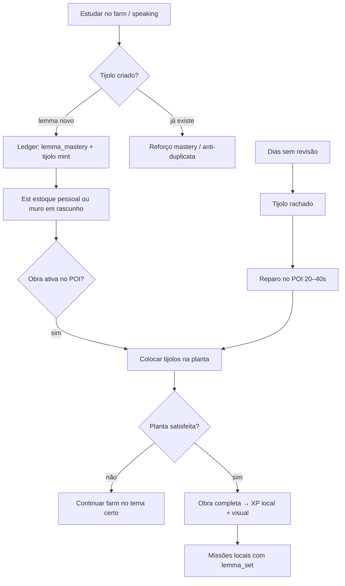

# Muro da Memória — Lexicon Brick

Especificação do sistema **#1** de aprendizado invisível do English Quest. Cada palavra aprendida vira **tijolo** que constrói a cidade — não um deck de flashcards.

> **Origem:** [INVISIBLE_LEARNING_SYSTEMS.md §1](./INVISIBLE_LEARNING_SYSTEMS.md#1-muro-da-memória-lexicon-brick)  
> **Relacionados:** [LIVING_CITY.md — Recursos](./LIVING_CITY.md#recursos-da-cidade-lexicon-e-insumos), [GAMIFICATION_SYSTEMS.md §3](./GAMIFICATION_SYSTEMS.md#3-lexicon-como-recurso-da-cidade), `src/features/city/services/city-resource-service.ts`, `src/data/poi-projects.json`

---

## Índice

1. [Visão e fantasia](#visão-e-fantasia)
2. [Estado no app hoje vs visão alvo](#estado-no-app-hoje-vs-visão-alvo)
3. [Mecânica (resumo dos 5 pilares de design)](#mecânica-resumo-dos-5-pilares-de-design)
4. [Loop do jogador](#loop-do-jogador)
5. [Entidade: tijolo lexicon](#entidade-tijolo-lexicon)
6. [Obras e plantas (blueprints)](#obras-e-plantas-blueprints)
7. [Decaimento e reparo (SRS embutido)](#decaimento-e-reparo-srs-embutido)
8. [Transferência pós-obra](#transferência-pós-obra)
9. [Integração com outros sistemas](#integração-com-outros-sistemas)
10. [Modelo de dados](#modelo-de-dados)
11. [Eventos e serviços](#eventos-e-serviços)
12. [UX e copy](#ux-e-copy)
13. [Economia e balanceamento](#economia-e-balanceamento)
14. [Conteúdo editável (JSON)](#conteúdo-editável-json)
15. [Fases de implementação](#fases-de-implementação)
16. [Métricas de sucesso](#métricas-de-sucesso)
17. [Sistema irmão: Grafite em Decaimento](#sistema-irmão-grafite-em-decaimento)

---

## Visão e fantasia

**Fantasia do jogador:** “Minha biblioteca cresce porque eu *sei* essas palavras — cada uma virou um tijolo no muro. Se eu paro de revisar, o muro racha; se volto, conserto e a cidade volta a brilhar.”

**Promessa de produto:**

| Para o jogador | Para o pedagogo |
| -------------- | --------------- |
| Construir cidade, não “fazer lição 12” | Aquisição + consolidação + transferência em contexto |
| Vocabulário = material de obra | SRS disfarçado de manutenção urbana |
| Progresso bloqueado sem palavras certas | Inevitabilidade lexical (não só grind de moedas) |

**Princípio central:** o tijolo não é moeda genérica — é **lemma ancorado** (identidade, tema, domínio). A obra pede *tipos* de tijolos, não “40 pontos de vocab”.

---

## Estado no app hoje vs visão alvo

| Capacidade | Hoje (shipped) | Visão Muro da Memória |
| ---------- | -------------- | --------------------- |
| Farm → recurso agregado | `WORDS_LEARNED` → `lexicon_brick` em `city_resources` | Cada palavra → **tijolo individual** no ledger |
| Obra semanal por POI | `poi-projects.json` + aba **Entregar** (biblioteca, prefeitura) | **Plantas** com mix temático (travel + food…) |
| Entrega | Debita saldo agregado (`deliveryChunk`) | Debita tijolos **específicos** colocados no muro |
| Decay / reparo | Não | Tijolo **rachado** → recall 20–40s no POI |
| Missões pós-obra | Pool genérico por POI | Missões filtradas por `lemma_set` do muro |
| Visual no mapa | `visual_stage` por XP local | Mural do POI reflete tijolos + estado de decay |
| Pet | — | Missão “carregar tijolo” até o POI |
| Eventos | Palavras do pack → mesmo `lexicon_brick` | Tijolos **sazonais** (`festive`, `spooky`…) |

O MVP atual é a **Fase 0** do Muro da Memória: logística de bricks sem identidade por palavra. Este documento define o alvo completo e o caminho de migração.

**Código canônico (hoje):**

- `CityResourceService` — grant em `WORDS_LEARNED`
- `CityPoiProjectService` — obra semanal, cap diário, `CITY_RESOURCE_DELIVERED`
- `city_resources`, `city_poi_projects`, `city_resource_delivery_caps` (schema)
- `BRICKS_PER_WORD_LEARNED` em `city-resource-config.ts`

---

## Mecânica (resumo dos 5 pilares de design)

### 1. Sistema (nome e mecânica)

**Nome:** Muro da Memória  
**Mecânica:** Palavra aprendida no farm → **tijolo lexicon** com metadados (`lemma`, CEFR, tema, última revisão). Tijolos são **colocados** em obras (biblioteca, embassy, mural do parque), não listados como deck. Obras seguem **plantas**: ex. “12 bricks `travel` + 5 `food`”. Sem tijolos certos, a barra não avança — **moedas não substituem** tijolos (só aceleram entrega ou cosméticos). Após **N dias** sem revisão, tijolo **racha** e conta **50%** no progresso até **reparo** no POI (micro-sessão).

### 2. Como o inglês é aprendido

| Fase | Mecanismo | Onde no jogo |
| ---- | --------- | ------------ |
| **Aquisição** | Reconhecimento + produção inicial no farm/speaking | Farm, `WORDS_LEARNED` |
| **Consolidação** | Recall ativo no reparo (digitar, escolher, falar) | POI da obra, 20–40s |
| **Transferência** | Missões locais exigem lemmas do muro concluído | `poi-missions` com `lemma_set` |

### 3. Conexão com outros sistemas

| Sistema | Integração |
| ------- | ---------- |
| **Cidade** | `city_poi_projects`, entregas, `visual_stage`, mural no pin/POI |
| **Farm** | Fonte de tijolos; packs de evento → tijolos temáticos |
| **Economia** | Moedas aceleram cronograma ou skin; **não** compram domínio lexical |
| **Pet** | Entrega narrativa: pet carrega tijolo → visita POI + recall leve |
| **Inventário** | Phrasal verbs / raros como tijolo equipável (slot construção) |
| **Ledger** | `lemma_mastery` alimenta elegibilidade de tijolo e decay |

### 4. Retenção e hábito diário

- Obra semanal reinicia **segunda** — ritual “segunda da biblioteca”.
- Rachadura visível no mapa (mural escurece) antes do decay grave.
- Push opcional: “O muro da biblioteca precisa de 2 tijolos reparados hoje”.
- Sinergia com **Grafite em Decaimento** (revisão geográfica no mapa).

### 5. Evitar “estou estudando”

UI mostra **planta da obra**, NPC pedindo material, barra de construção. O jogador pensa em **urbanismo e reputação na cidade**, não em “revisar deck 4”.

---

## Loop do jogador



**Sessão típica (3–8 min):**

1. Abrir mapa → biblioteca com badge de obra.
2. Ver planta: “Faltam 3 tijolos `airport`”.
3. Farm com mix de palavras de viagem (ou revisar 2 rachados na biblioteca).
4. Voltar → colocar tijolos → barra sobe.
5. Opcional: entregar lote (`deliveryChunk`) se ainda usar saldo agregado na transição.

---

## Entidade: tijolo lexicon

### Identidade

```typescript
// Conceito — contrato de dados alvo
type LexiconBrick = {
  brickId: string;           // uuid estável ou hash(lemma_id + player)
  lemmaId: string;           // chave canônica EN
  lemma: string;
  translation: string;
  themeTags: string[];       // travel, food, work, event:christmas_2026
  cefrBand?: 'A1' | 'A2' | 'B1' | 'B2';
  source: 'farm' | 'speaking' | 'event_pack' | 'chain_reward';
  mintedAt: string;
  lastReviewAt: string;
  nextReviewAt: string;
  decayStage: 0 | 1 | 2 | 3; // 0=sólido … 3=rachado
  placedOn?: {
    poiKey: string;
    projectKey: string;
    placedAt: string;
  };
};
```

### Regras de mint

| Regra | Detalhe |
| ----- | ------- |
| 1 palavra nova aprendida | 1 tijolo (hoje: `BRICKS_PER_WORD_LEARNED = 1` no saldo agregado) |
| Palavra já dominada | Não duplica tijolo; +mastery no ledger |
| Palavra de evento | Tag `event:{eventKey}`; pode contar em planta sazonal |
| Qualidade | Opcional: speaking session “perfeita” → tijolo **reforçado** (2× peso na planta) |

### Estados visuais

| `decayStage` | Nome UI | Efeito na obra |
| ------------ | ------- | -------------- |
| 0 | Sólido | 100% do peso na planta |
| 1 | Desgaste leve | 100% (alerta visual) |
| 2 | Rachado | 50% até reparo |
| 3 | Apagado | 0% — não conta; obriga reparo |

**Intervalos SRS (rascunho):** 1d → 3d → 7d → 14d entre revisões bem-sucedidas; falha reseta estágio.

---

## Obras e plantas (blueprints)

### Obra vs planta

- **Obra (`city_poi_project`):** instância semanal no POI (já existe).
- **Planta (`project_blueprint`):** template que define **quais tijolos** aceita, não só `targetTotal` genérico.

### Exemplo de planta

```json
{
  "projectKey": "library_lexicon_wing",
  "poiKey": "central_library",
  "title": "Ala infantil da biblioteca",
  "blueprint": {
    "slots": [
      { "themeTag": "education", "count": 15, "label": "Palavras do acervo" },
      { "themeTag": "food", "count": 5, "label": "Café da biblioteca" },
      { "themeTag": "any", "count": 10, "label": "Tijolos gerais" }
    ],
    "allowCrackedWeight": 0.5
  },
  "deliveryChunk": 5,
  "weekReset": "monday",
  "localXpOnComplete": 30,
  "vitalityOnComplete": 3
}
```

### Migração desde `poi-projects.json` atual

Hoje:

```json
{
  "resourceType": "lexicon_brick",
  "targetTotal": 40,
  "deliveryChunk": 10
}
```

Transição:

1. **Fase A:** manter `targetTotal` + saldo agregado (comportamento atual).
2. **Fase B:** planta com `slots` + UI “faltam X do tema Y”; entrega ainda pode debitar agregado se tema não mapeado.
3. **Fase C:** só aceita tijolos colocados que satisfazem slots; saldo agregado vira **legado** ou conversão 1:1 “tijolo genérico” (`themeTag: any`).

### POIs candidatos a muro

| POI | Tipo de muro | Temas típicos |
| --- | ------------ | ------------- |
| `central_library` | Estante / ala | education, reading, event pack |
| `embassy_row` | Mural diplomático | travel, formal, work |
| `airport_gate` | Painel de embarque | travel, airport |
| `city_park` | Mural comunitário | social, park, pet |
| `winter_market` | Barraca (sazonal) | `event:christmas_2026` |

---

## Decaimento e reparo (SRS embutido)

### Gatilho de decay

- Job no **hydrate** / abertura do mapa: `now > nextReviewAt` → `decayStage++`.
- Notificação opcional ligada ao POI onde o tijolo está **placed**.

### Fluxo de reparo (micro-sessão)

1. Jogador toca tijolo rachado na UI da obra (ou banner “2 rachaduras”).
2. Modal **Reparar muro** — 1–3 ítens:
   - **Recall:** completar lacuna (`appl_` → apple).
   - **Choice:** 4 opções, 1 correta.
   - **Speak (opcional):** 1 frase curta com a palavra.
3. Sucesso → `decayStage = 0`, `lastReviewAt = now`, `nextReviewAt` recalculado.
4. Falha → permanece rachado; pet/NPC dá dica (sem punir streak global).

### Por que não é “aula”

- Duração fixa curta, contexto do NPC do POI (“A estante precisa desta palavra”).
- Falha = cidade feia, não nota vermelha.

---

## Transferência pós-obra

Quando a obra da semana completa:

1. **Recompensa imediata:** XP local, vitalidade, possível `visual_stage+1`.
2. **Desbloqueio de pool:** missões em `poi-missions.json` com `"requiresLemmaSet": "library_wing_week_12"`.
3. **NPC:** linha de diálogo citando 1–2 palavras do muro (“We finally cataloged *wanderlust*.”).

### Exemplo de missão gated

```json
{
  "templateKey": "lib_use_wing_vocab",
  "poiKey": "central_library",
  "missionType": "speaking_units",
  "targetValue": 3,
  "requiresLemmaSet": "library_lexicon_wing",
  "minLocalLevel": 2,
  "title": "Palavras da nova ala",
  "description": "Use no farm palavras que você colocou no muro esta semana."
}
```

---

## Integração com outros sistemas

### Farm

- Ao emitir `WORDS_LEARNED`, além do grant agregado (hoje), chamar `LexiconBrickService.mintFromLemma`.
- Vocab pack de evento: tag automática `event:{eventKey}` no tijolo.

### Cidade viva

- `CITY_RESOURCE_DELIVERED` → evoluir para `LEXICON_BRICK_PLACED` com payload `{ poiKey, lemmaId, weight }`.
- Vitalidade: penalidade leve se **>30%** tijolos colocados na cidade estão rachados (opcional).

### Pet

- Missão opcional `pet_carry_brick`: após mint, pet “segura” até visita ao POI; visita dispara recall leve (+felicidade).
- Memória do pet: “Ajudei a levar *chimney* até a biblioteca.”

### Economia

| Permitido | Proibido |
| --------- | -------- |
| Moedas para **cosmético** de muro / acelerar timer de obra | Comprar tijolos de tema que o jogador não aprendeu |
| SP para upgrade tier 4+ do POI (já em LIVING_CITY) | Pay-to-skip planta lexical |

### Grafite em Decaimento (sistema #5)

- **Muro:** SRS ligado a **obras** e plantas temáticas.
- **Grafite:** SRS ligado a **mapa** e visibilidade pública.
- Mesmo `lemma_mastery`; duas superfícies de UI.

---

## Modelo de dados

### Tabelas novas (alvo)

```text
lemma_mastery
  lemma_id PK
  recognition_score    -- 0-100
  production_score     -- 0-100
  last_review_at
  next_review_at
  decay_stage          -- 0-3
  theme_tags_json
  contexts_seen_json   -- poiKey, missionId, …

lexicon_bricks
  brick_id PK
  lemma_id
  theme_tags_json
  source
  minted_at
  last_review_at
  next_review_at
  decay_stage
  placed_poi_key       -- nullable
  placed_project_key   -- nullable
  placed_at

city_poi_project_brick_progress  -- opcional: denormalizado
  project_id
  slot_index
  filled_count
  target_count
```

### Tabelas existentes (mantidas na transição)

```text
city_resources
  resource_type
  balance              -- lexicon_brick agregado até Fase C

city_poi_projects
  progress, target_total, resource_type, week_start_date, …
```

### Repositórios / serviços sugeridos

| Módulo | Responsabilidade |
| ------ | ---------------- |
| `LemmaMasteryRepository` | CRUD + queries por tema / decay |
| `LexiconBrickRepository` | Mint, place, repair, list by POI |
| `LexiconBrickService` | Ouve `WORDS_LEARNED`, orquestra decay no hydrate |
| `CityPoiProjectService` | Estender `deliver` para validar planta + tijolos |

---

## Eventos e serviços

### GameEvents (novos ou estendidos)

| Evento | Quando |
| ------ | ------ |
| `WORDS_LEARNED` | Já existe — passa a alimentar mint + saldo agregado |
| `LEXICON_BRICK_MINTED` | Novo tijolo criado |
| `LEXICON_BRICK_PLACED` | Tijolo assentado na planta |
| `LEXICON_BRICK_CRACKED` | Decay stage ≥ 2 |
| `LEXICON_BRICK_REPAIRED` | Reparo bem-sucedido |
| `MEMORY_WALL_COMPLETED` | Planta da obra satisfeita |
| `CITY_RESOURCE_DELIVERED` | Mantido durante transição (entrega por chunk) |

### Listeners

| Serviço | Ação |
| ------- | ---- |
| `LexiconBrickService` | mint, decay tick, repair |
| `CityPoiProjectService` | validar slots, completar obra |
| `CityMapService` | badge POI “muro precisa de reparo” |
| `FarmService` | (opcional) destacar palavras do tema da planta ativa |
| `PetMemoryService` | capítulo em `LEXICON_BRICK_PLACED` / repair |

---

## UX e copy

### Superfícies

| Onde | O quê |
| ---- | ----- |
| **Mapa** | Badge no POI: obra %, ícone rachadura se decay |
| **POI → aba Entregar** | Planta visual (slots), estoque de tijolos por tema, botão Colocar / Reparar |
| **Farm** | Chip: “Biblioteca precisa: travel ×3” (planta ativa) |
| **Header mapa** | `CityResourceStrip` mantém totais; tooltip “X tijolos sólidos, Y rachados” |

### Copy (PT shell, EN nas missões de estudo)

| Situação | Exemplo |
| -------- | ------- |
| Planta incompleta | “Faltam 5 tijolos de **viagem** para a estante.” |
| Rachadura | “Esta palavra enfraqueceu — repare o muro (30s).” |
| Obra completa | “A ala infantil abriu! Novas missões na biblioteca.” |
| NPC | “Cada tijolo aqui é uma palavra que você realmente guardou.” |

### Wireframe lógico (aba Entregar)

```text
┌─ Obra da semana: Ala infantil ─────────────┐
│ [██████░░░░] 60%                            │
│ ■■■■■□□  education 15/15                   │
│ ■■□□□   food 5/10                          │
│ ■□□□□   any 2/10                           │
│ [ Colocar tijolos ]  [ Reparar 2 rachados ] │
└────────────────────────────────────────────┘
```

---

## Economia e balanceamento

### Faucets

| Fonte | Tijolos / semana (referência) |
| ----- | ----------------------------- |
| Farm regular | 15–40 lemmas novos → 15–40 tijolos |
| Evento vocab | +5–10 tijolos temáticos |
| Speaking | Opcional: tijolo “reforçado” (conta como 2 em slot `any`) |

### Sinks

| Sink | Volume |
| ---- | ------ |
| Planta semanal biblioteca | 20–30 tijolos equivalentes (mix) |
| Reparo | Tempo (não consome tijolo) |
| Colocação errada | Impossível — UI só permite tema válido |

### Caps (alinhado ao app atual)

- `DAILY_DELIVERY_CAP.lexicon_brick = 80` — pode limitar **colocações** por dia, não apenas saldo.
- Obra não completa com moedas — regra de design **hard**.

### Tabela de referência

| Ação | XP local | Vitalidade | Mastery |
| ---- | -------- | ---------- | ------- |
| Mint 1 tijolo | — | — | +recognition |
| Colocar tijolo na planta | — | — | +context |
| Reparar rachado | — | +0.5 | +production |
| Completar planta | 25–45 | +3–5 | — |
| Missão `lemma_set` | 10–25 | +1 | +transfer |

Detalhar números em [`BALANCE_AUDIT.md`](./BALANCE_AUDIT.md) na Fase B.

---

## Conteúdo editável (JSON)

| Arquivo | Papel |
| ------- | ----- |
| `src/data/poi-projects.json` | Obras + plantas (evoluir schema) |
| `src/data/lemma-themes.json` (novo) | Mapeamento lemma → `themeTags` |
| `src/data/vocab-packs/*.json` | Tags de evento para mint |
| `src/data/poi-missions.json` | `requiresLemmaSet` opcional |

### Sync

Incluir novos JSON em `scripts/sync-content-json.ts` quando criados.

---

## Fases de implementação

| Fase | Escopo | Depende de |
| ---- | ------ | ---------- |
| **0** ✅ | Saldo `lexicon_brick` + obras `targetTotal` + entrega chunk | — |
| **A** | `lemma_mastery` + mint idempotente por `lemma_id` | Farm events |
| **B** | Plantas com `slots` + UI colocar por tema; agregado como fallback `any` | Fase A |
| **C** | Decay + reparo no POI; badge mapa | `lemma_mastery` |
| **D** | Missões `requiresLemmaSet`; mural visual no POI | Obra completa |
| **E** | Pet carry brick; tijolos sazonais; embassy/airport plantas | Conteúdo |

Ordem alinhada a [INVISIBLE_LEARNING_SYSTEMS.md — Priorização](./INVISIBLE_LEARNING_SYSTEMS.md#ordem-de-implementação-sugerida-produto): **Fase A do roadmap global = Muro + Grafite**.

---

## Métricas de sucesso

| Métrica | Meta | Como medir |
| ------- | ---- | ---------- |
| **Placements per DAU** | ≥1 colocação ou reparo em dias com farm | Eventos `PLACED` / `REPAIRED` |
| **Decay recovery rate** | ≥60% tijolos rachados reparados em 72h | `CRACKED` → `REPAIRED` |
| **Obra completion rate** | ≥40% jogadores com obra ativa completam na semana | `MEMORY_WALL_COMPLETED` |
| **Transfer missions** | ≥25% missões locais gated completadas após obra | Por `lemma_set` |
| **Autopercepção** | ≥70% “Senti que joguei” vs estudou | Pesquisa in-app quinzenal |

Anti-métrica: jogadores que só farmam `any` ignorando slots temáticos — indicador de planta mal calibrada ou UI confusa.

---

## Sistema irmão: Grafite em Decaimento

| | Muro da Memória | Grafite em Decaimento |
| - | --------------- | --------------------- |
| **Metáfora** | Construir estante / mural na obra | Restaurar arte na rua |
| **SRS** | Reparo na aba Entregar do POI | Micro-missão no pin do mapa |
| **Escopo** | Palavras **colocadas** em projeto ativo | Palavras **dominadas** visíveis na cidade |
| **Ledger** | Mesmo `lemma_mastery` | Mesmo `lemma_mastery` |

Implementar Grafite sem Muro fragmenta o ledger; **Muro primeiro** garante que tijolos existem antes de pintar o mapa.

---

## Decisões em aberto

| # | Decisão | Opções |
| - | ------- | ------ |
| 1 | Tijolo 1:1 com palavra ou com “unidade” do farm? | 1:1 lemma vs 1 por sessão |
| 2 | Saldo agregado desaparece quando? | Fase C vs convive eternamente |
| 3 | Reparo obrigatório para progredir obra? | Hard gate vs soft (50% peso) |
| 4 | Tijolos sazonais expiram após evento? | Convertem para `any` vs arquivam |
| 5 | Onde vive UI de estoque de tijolos? | Só POI vs tela “Mochila de construção” |

---

## Glossário

| Termo | Significado |
| ----- | ----------- |
| **Tijolo lexicon** | Unidade de vocabulário aprendido, identificada por lemma |
| **Planta** | Requisitos temáticos de uma obra |
| **Obra** | Instância semanal de projeto no POI |
| **Rachado** | Estado de decay com peso reduzido na planta |
| **Reparo** | Micro-sessão de recall no POI |
| **Lemma set** | Conjunto de lemmas desbloqueados por uma obra concluída |

---

_Documento de design — maio/2026. Sistema #1 de [INVISIBLE_LEARNING_SYSTEMS.md](./INVISIBLE_LEARNING_SYSTEMS.md). Fase 0 implementada em `city_resources` + `poi-projects`; fases A–E planejadas._
